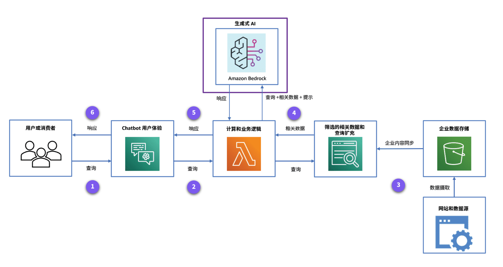
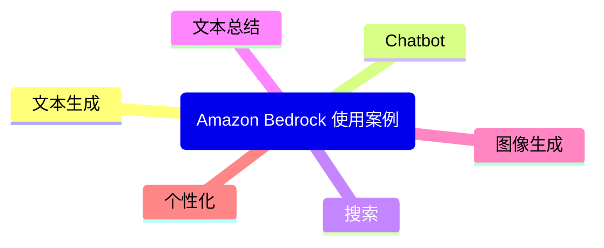
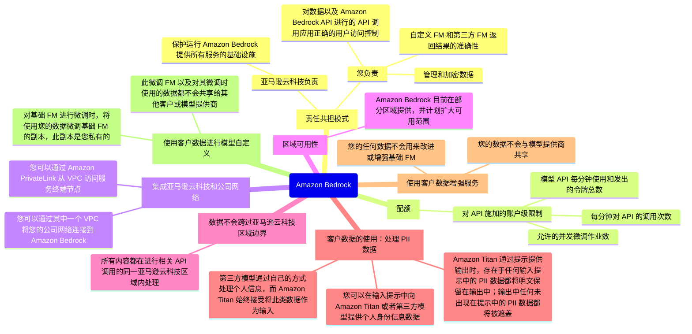
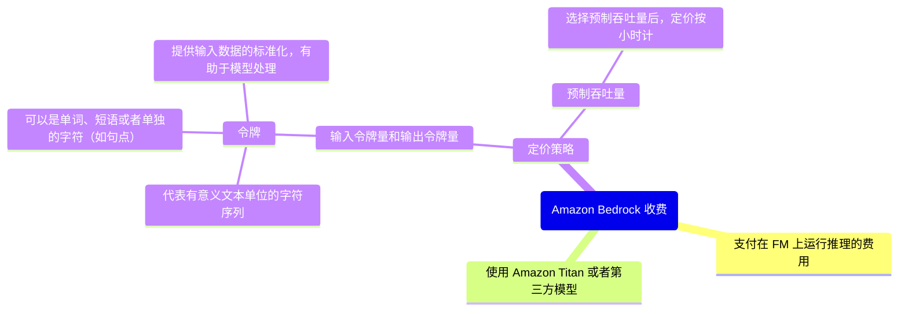

# 架构和使用案例

## 如何使用 Amazon Bedrock 构建生成式 AI 应用程序？

以下架构展示了由生成式 AI 和客户数据提供支持的云 Chatbot 解决方案。此解决方案能够以自然语言与您交流，同时通过包含客户数据保持准确性。

1. **用户查询**：用户或消费者通过用户界面向能够理解自然语言的 Chatbot 进行查询。
2. **计算和业务逻辑**：查询经过处理后发送到计算层，计算层根据业务逻辑和用户查询在相关服务之间路由和编排请求与响应。
3. **相关数据**：随后会使用经过筛选的相关数据对查询进行扩充。此数据与从数据库、网站和文件存储库等来源存储和摄取的企业数据保持同步。
4. **查询扩充**：现在扩充了相关企业数据的查询会发送到生成式 AI 服务 Amazon Bedrock。
5. **生成式 AI 响应**：Amazon Bedrock 使用 FM 获取查询响应，并将其路由回计算层。
6. **响应用户**：计算层将响应发送到 Chatbot 用户界面，向用户或消费者提供最终的自然语言响应。

## Amazon Bedrock 有哪些典型使用案例？

## 关于 Amazon Bedrock，您还应该记住什么？

## Amazon Bedrock 如何收费？

## 知识考核

### 以下哪一项是 Amazon Bedrock 的常见使用案例？

- [ ] 需求预测
- [X] 使用相关数据的对话式 Chatbot
- [ ] 从图像中提取文本
- [ ] 车辆的预测性维护