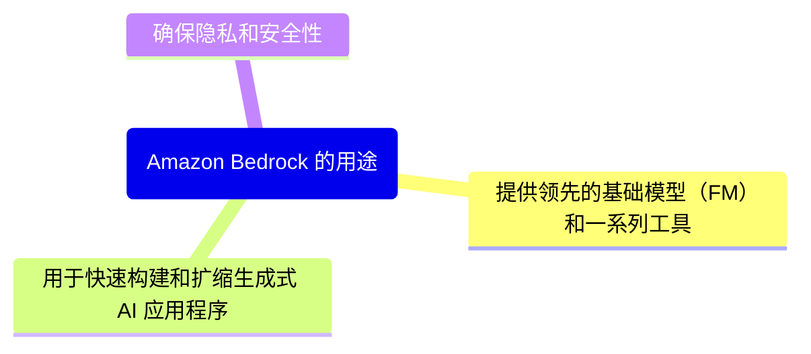
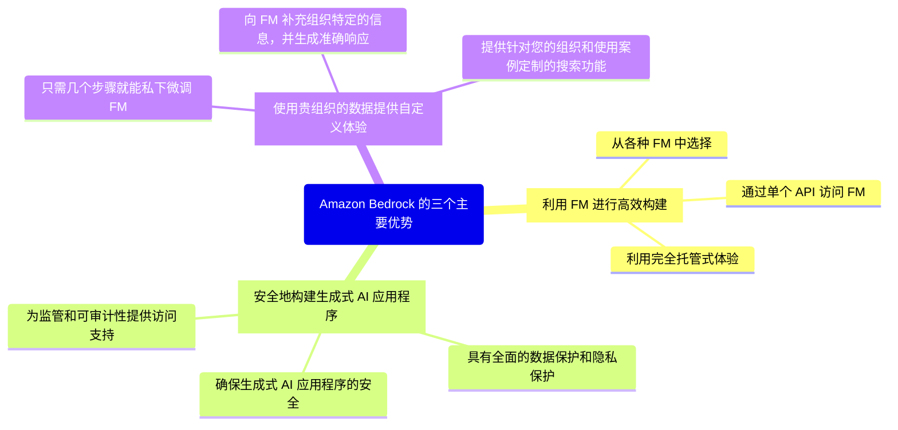

# Amazon Bedrock 简介

## Amazon Bedrock 的用途

## Amazon Bedrock 的优势

## 知识考核

### Amazon Bedrock 可以解决以下哪些问题？ （请选择三项。）

- [X] 客户希望访问多个模型，以便可以选择最适合其需求的模型。
- [X] 客户希望对模型进行微调时保持其数据的私有性。
- [ ] 客户想要在本地使用基础模型 (FM)。
- [X] 客户不想管理其基础设施。
- [ ] 客户想要从头开始构建并训练基础模型 (FM)。
- [ ] 客户想要编码配套应用程序。

### 以下哪些是使用 Amazon Bedrock 的优势？ （请选择三项。）

- [X] 提示和响应不会共享给亚马逊云科技或第三方提供商。
- [ ] Amazon Bedrock 提供单独的 API 来访问不同的基础模型 (FM)。
- [X] Amazon Bedrock 允许私下对基础模型 (FM) 进行自定义。
- [X] Amazon Bedrock 让用户可以获取 Amazon 和第三方提供商提供的各种基础模型 (FM)。
- [ ] Amazon Bedrock 要求客户预置其自己的基础设施。
- [ ] Amazon Bedrock 会使用您的提示和响应训练第三方模型。