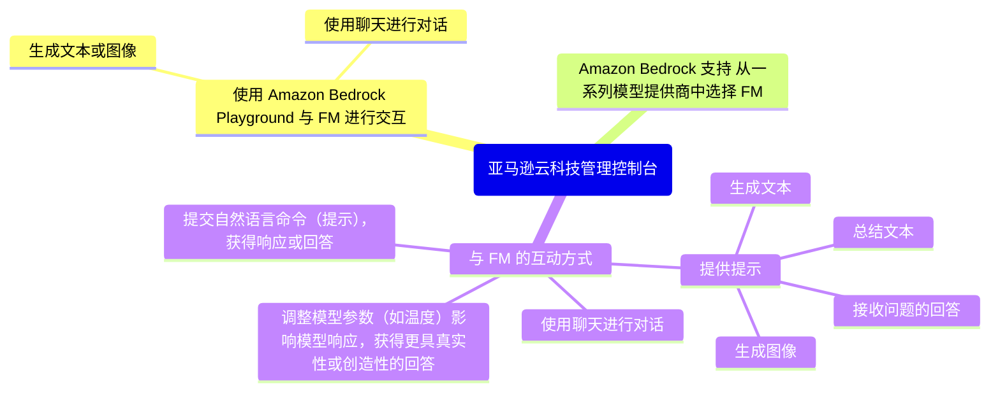
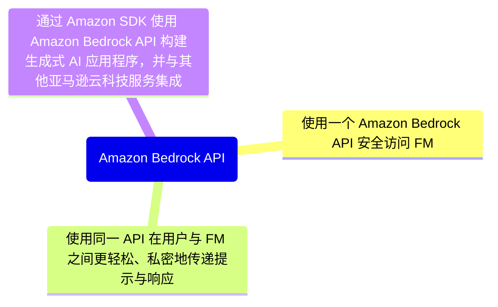
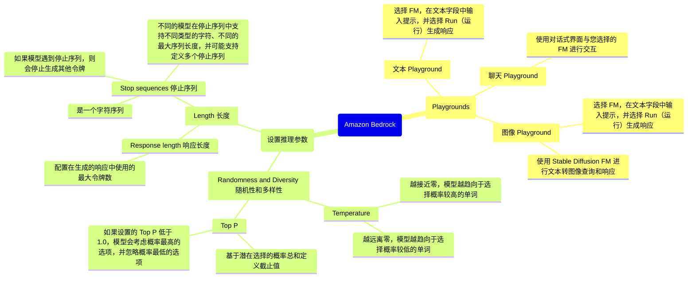

# 如何使用 Amazon Bedrock

## Amazon Bedrock 有哪些基本技术概念？

### 亚马逊云科技管理控制台

```mermaid
mindmap
(亚马逊云科技管理控制台)
    使用 Amazon Bedrock Playground 与 FM 进行交互
        生成文本或图像
        使用聊天进行对话
    Amazon Bedrock 支持 从一系列模型提供商中选择 FM
    与 FM 的互动方式
        提交自然语言命令（提示），获得响应或回答
        调整模型参数（如温度）影响模型响应，获得更具真实性或创造性的回答
        提供提示
            生成文本
            生成图像
            总结文本
            接收问题的回答
        使用聊天进行对话
```

### Amazon Bedrock API

```mermaid
mindmap
(Amazon Bedrock API)
    使用一个 Amazon Bedrock API 安全访问 FM
    使用同一 API 在用户与 FM 之间更轻松、私密地传递提示与响应
    通过 Amazon SDK 使用 Amazon Bedrock API 构建生成式 AI 应用程序，并与其他亚马逊云科技服务集成
```

## 如何与 Amazon Bedrock Playground 进行交互？

Amazon Bedrock Playground 架构图：

```mermaid
mindmap
(Amazon Bedrock)
    (Playgrounds)
        [文本 Playground]
            选择 FM，在文本字段中输入提示，并选择 Run（运行）生成响应
        [聊天 Playground]
            使用对话式界面与您选择的 FM 进行交互
        [图像 Playground]
            选择 FM，在文本字段中输入提示，并选择 Run（运行）生成响应
            使用 Stable Diffusion FM 进行文本转图像查询和响应
    (设置推理参数)
        [Randomness and Diversity 随机性和多样性]
            Temperature
                越接近零，模型越趋向于选择概率较高的单词
                越远离零，模型越趋向于选择概率较低的单词
            Top P
                基于潜在选择的概率总和定义截止值
                如果设置的 Top P 低于 1.0，模型会考虑概率最高的选项，并忽略概率最低的选项
        [Length 长度]
            Response length 响应长度
                配置在生成的响应中使用的最大令牌数
            Stop sequences 停止序列
                是一个字符序列
                如果模型遇到停止序列，则会停止生成其他令牌
                不同的模型在停止序列中支持不同类型的字符、不同的最大序列长度，并可能支持定义多个停止序列
```