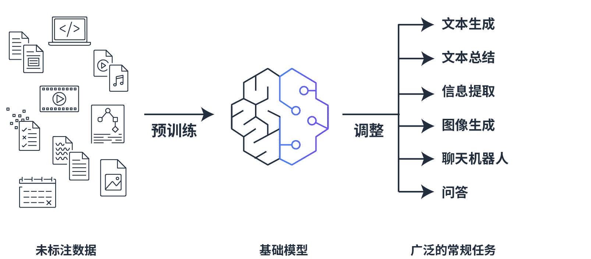
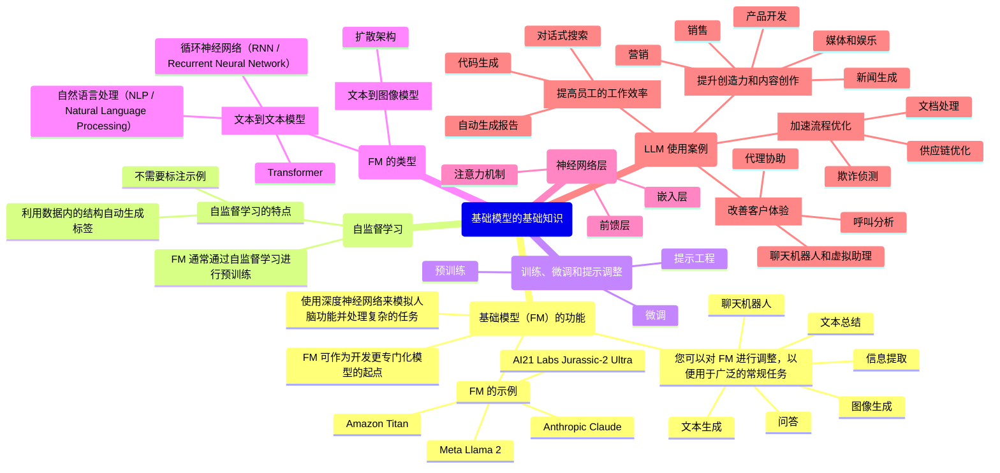

# 基础模型的基础知识

## 了解基础模型 (FM) 功能

* 使用深度神经网络来模拟人脑功能并处理复杂的任务
* 您可以对 FM 进行调整，以便用于广泛的常规任务
    * 文本生成
    * 文本总结
    * 信息提取
    * 图像生成
    * 聊天机器人
    * 问答
    * ……
* FM 可作为开发更专门化模型的起点
* FM 的示例：
    * Amazon Titan
    * Meta Llama 2
    * Anthropic Claude
    * AI21 Labs Jurassic-2 Ultra

### 自监督学习

* FM 通常通过自监督学习进行预训练
* 自监督学习的特点：
    * 不需要标注示例
    * 利用数据内的结构自动生成标签

### 训练、微调和提示调整

基础模型要经过不同阶段的训练才能达到最佳效果：预训练、微调、提示工程。

1. **预训练**
    * FM 使用自监督学习或基于人类反馈的强化学习，从大量数据集中捕获数据
        * 学习数据集中单词的含义、上下文和关系
    * FM 可以使用基于人类反馈的强化学习技术来使模型更好地适应人类偏好
        * 人类提供关于模型结果的反馈
        * 然后模型又使用这些信息来改变其行为
2. **微调**
    * 微调 FM 基础模型可以提高性能
        * 微调是有监督学习过程，涉及采用经过预训练的模型并添加特定的较小数据集
            * 添加这些较小的数据集将修改数据的权重，以更好地适应任务
        * 两种微调模型的方法：
            * **指令微调**
                * 使用关于模型应如何响应特定指令的示例
                * 提示调整是指令微调的一种
            * **RLHF**
                * 该方法提供人类反馈数据，从而产生更符合人类偏好的模型
        * 使用案例：处理需要行业知识的任务
            * 使用预训练模型 → 对其进行微调
3. **提示工程**
    * 提示充当基础模型的指令
    * 提示类似于微调，但您不需要提供对模型进行微调时所提供的标注样本数据
    * 您可以使用各种提示技术来实现更好的性能
    * 与需要标注数据和训练基础设施的微调相比，提示工程是一种调整 LLM 响应的更有效方法

## FM 的类型

最常见的两种模型：文本到文本模型、文本到图像模型。

* **文本到文本模型**
    * **自然语言处理（NLP / Natural Language Processing）**
        * 赋予机器解释和操纵人类语言的能力
        * 通过分析信息中的数据、意图或情绪并对人类交流做出反应来实现
        * 收集数据：收集和准备不同来源的非结构化文本或语音数据，并处理这些数据
        * 处理数据：使用表计划、词干提取、词形还原、停用词删除、词性标注、命名实体识别、语音识别、情感分析等技术
    * **循环神经网络（RNN / Recurrent Neural Network）**
        * 使用记忆机制来存储和应用来自先前输入的数据
        * 有效地处理序列数据和任务，例如自然语言处理、语音识别或机器翻译
        * 局限性：训练缓慢及复杂，不能用于训练并行化
        * 改进：长短期记忆网络（LSTM）
    * **Transformer**
        * 具有将输入文本转换为嵌入的编码器组件
        * 具有使用嵌入来发出一些输出文本的解码器组件
        * 具有极高的并行性，可同时处理所有输入，显著缩短训练时间，但需要更高计算能力加快计算速度
        * Transformer 架构是 LLM 开发的关键
        * 如今大多数 LLM 仅包含解码器组件
* **文本到图像模型**
    * **扩散架构**
        * 通过两步过程进行学习
            * 第一步：**前向扩散**
                * 系统逐渐向输入图像引入少量噪声，直到只剩下噪声
                * 使用 U-Net 模型可以跟踪和预测噪声水平
            * 第二步：**逆向扩散**
                * 对噪声图像逐步进行去噪，直到生成新图像
                * 在训练过程中，模型获得文本馈送，并将其添加到图像向量中
        * 应用：用隐式扩散模型进行高分辨率图像合成

## 大语言模型

* <b>大语言模型（LLM，Large Language Model）</b>是基础模型的子集
* LLM 在许多自然语言任务中基于数万亿个单词进行训练
* LLM 可以理解、学习和生成与人类产生的文本几乎没有区别的文本
* LLM 还可以进行交互式对话、回答问题、总结对话和文档以及提供建议
* LLM 可以处理大量的文本数据
* LLM 具有广泛的能力：
    * 营销创意写作
    * 总结法律文件
    * 为金融团队准备市场研究
    * 为医疗保健行业模拟临床试验
    * 为软件开发编写代码

## 了解 LLM 功能

* 大多数 LLM 都是基于 Transformer 模型的
    * 接受输入 → 对数据进行编码 → 对数据进行解码以产生输出预测

### 神经网络层

* **嵌入层**
    * 将输入文本转换为称为嵌入的向量表示
    * 捕获嵌入之间的复杂关系，使模型可以理解文本的上下文
* **前馈层**
    * 将嵌入转换为其更高权重的版本
    * 这一层继续将语言置于上下文中，帮助模型更好地理解输入文本的意图
* **注意力机制**
    * 关注输入文本中最相关的部分
    * 是 Transformer 模型的核心部分，可帮助模型获得最准确的输出结果

## LLM 使用案例

1. 改善客户体验
    * **聊天机器人和虚拟助理**：通过基于生成式 AI 的聊天机器人、语音机器人和虚拟助理自动响应客户服务查询，简化客户自助服务流程，降低运营成本。
    * **呼叫分析**：分析联系中心的呼叫，提取有价值的见解，从而改善客户体验和忠诚度。
    * **代理协助**：使用 AI 和生成式 AI 来支持和增强人工代理在客户服务、问题解决和决策等任务中的能力。
2. 提高员工的工作效率
    * **对话式搜索**：通过对话界面快速轻松地查找准确信息及总结内容，从而提高员工的工作效率。
    * **代码生成**：通过基于开发人员的注释和代码提供代码建议，加速应用程序开发，提高开发人员的工作效率。
    * **自动生成报告**：自动生成财务报告、摘要和预测，节省时间并减少错误。
3. 提升创造力和内容创作
    * **营销**：创建引人入胜的营销内容，例如博客文章、社交媒体更新或电子邮件新闻通讯，节省时间和资源。
    * **销售**：根据潜在客户的个人资料和行为生成个性化电子邮件和消息，提高回复率。根据客户的细分、行业以及产品或服务生成销售话术或谈话要点。
    * **产品开发**：AI 可以根据特定输入和约束生成多个设计原型，加快完成构思阶段。AI 可以根据用户反馈和指定约束优化现有设计。
    * **媒体和娱乐**：您可以使用生成式 AI 来创建脚本和对话。您还可以用它来为电影、电视节目和游戏制作故事。
    * **新闻生成**：AI 可以根据原始数据或事件生成新闻文章或摘要。
4. 加速流程优化
    * **文档处理**：通过基于生成式 AI 的问答，自动从文档和见解中提取和总结数据，改善业务运营。
    * **欺诈侦测**：生成式 AI 模型可以学习欺诈交易的模式，然后创建合成欺诈模式，来训练更稳健的欺诈侦测系统。
    * **供应链优化**：通过评估和优化不同的供应链场景，改善物流并降低成本。

## 相关资料

* [“生成式 AI 和基础模型入门” (Getting Started with Generative AI and Foundation Models)](https://d1.awsstatic.com/products/generative-ai/getting-started-with-generative-ai-and-foundation-models.pdf)
* [“什么是自然语言处理 (NLP)？“ (What Is Natural Language Processing (NLP)?)](https://aws.amazon.com/what-is/nlp/)
* [“循环神经网络 (RNN) 和长短期记忆 (LSTM) 网络的基础知识” (Fundamentals of Recurrent Neural Network (RNN) and Long Short-Term Memory (LSTM) Network)](https://arxiv.org/abs/1808.03314)
* [“绕不过去的注意力” (Attention is All You Need)](https://arxiv.org/abs/1706.03762)
* [“用隐式扩散模型进行高分辨率图像合成” (High-Resolution Image Synthesis with Latent Diffusion Models)](https://arxiv.org/abs/2112.10752)