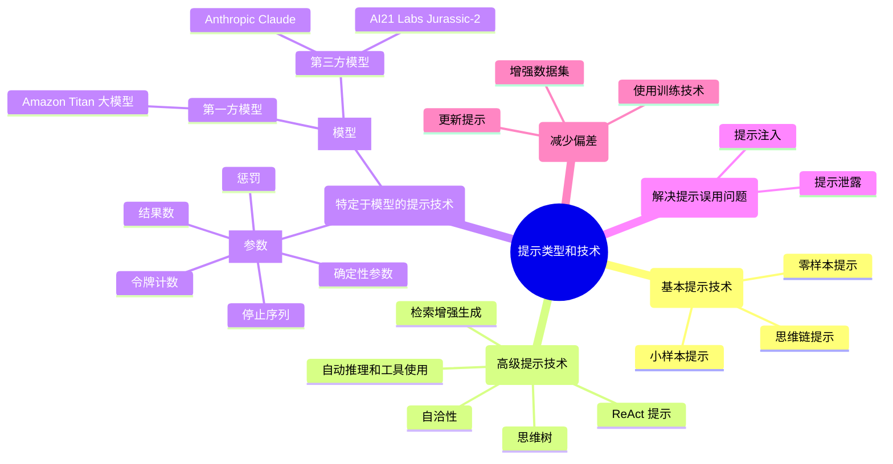

# 提示类型和技术

```mermaid
mindmap
((提示类型和技术))
    (基本提示技术)
        零样本提示
        小样本提示
        思维链提示
    (高级提示技术)
        自洽性
        思维树
        检索增强生成
        自动推理和工具使用
        ReAct 提示
    (特定于模型的提示技术)
        [参数]
            确定性参数
            令牌计数
            停止序列
            结果数
            惩罚
        [模型]
            第一方模型
                Amazon Titan 大模型
            第三方模型
                Anthropic Claude
                AI21 Labs Jurassic-2
    (解决提示误用问题)
        提示注入
        提示泄露
    (减少偏差)
        更新提示
        增强数据集
        使用训练技术
```