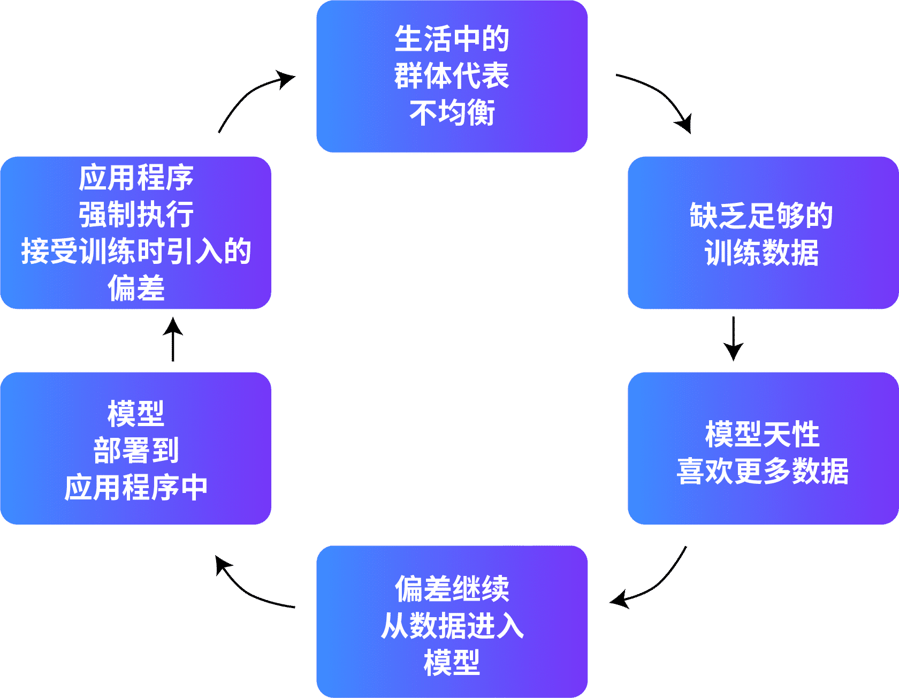

# 减小偏差

用于训练 AI 模型的数据可能有偏差。如果数据有偏差，AI 模型可能会重现这些偏差。最终，您可能会得到有偏差或不公平的输出。偏差可以通过以下两种方式出现在提示工程中。

1. 如果提示建立在假设的基础上，那么提示本身可能是有偏差的。
2. 即使编写的提示没有偏差，AI 模型有时也会产生有偏差的结果。产生这些结果是由于训练数据中可能存在偏差。

如果在训练模型时没有足够的数据，这种缺乏数据的情况可能会导致偏差。如果模型是在数据不足的情况下进行训练的，则会导致模型置信度低。大多数毒性筛选条件和排序算法本质上会优先考虑模型置信度。这导致许多群体被推定为排除在外，从而使偏差长期存在。

偏差循环图：

## 减小偏差的三种技术

以下三种技术可以帮助减少 FM 中的偏差：

1. [更新提示](#更新提示)
2. [增强数据集](#增强数据集)
3. [使用训练技术](#使用训练技术)

### 更新提示

为 FM 编写提示时，提供明确指引可大规模减少意外的表现。

减小模型输出中偏差的几种方法：

1. **文本到图像消歧义（TIED）框架**
    * 是一种专注于避免提示中歧义的方法
    * 使用 TIED 框架，模型将生成问题以消除提示的歧义
2. **文本到图像消歧义基准（TAB，Text-to-Image Ambiguity Benchmark）**
    * 使用 TAB 在提示中提供架构，以提出澄清式问题
3. **使用小样本学习来进行澄清**
    * 让模型使用小样本学习来生成澄清式问题

通过使用消歧义提示，您更有可能减少模型输出中的偏差。

### 增强数据集

您还可以通过增强训练数据集来帮助减少偏差。通过提供不同类型的代词和添加不同的示例等措施，模型可以开始生成更多样化的输出。

* 对于通过文本训练的 LLM，您可以使用**反事实数据增强技术**。数据增强技术是指，通过使用现有数据集的修改数据来人为地扩展模型训练集。
* 对于通过图像训练的 LLM，您也可以使用反事实数据增强。增强图像以引入更高多样性的过程包括以下三个步骤:
    1. **检测**：使用图像分类来检测数据集中的人、物体和背景。计算汇总统计数据以检测数据集不平衡性。
    2. **分段**：使用分段来生成要替换的对象的像素图。
    3. **扩充**：使用图像到图像技术来更新图像并均衡分布。

### 使用训练技术

在训练层面有两种技术可用来帮助减少偏差。这两种技术使用概率均等并使用公平性准则作为模型目标。

1. **用概率均等来衡量公平性**
    * 概率均等旨在均衡模型在预测不同组的分类结果时产生的误差。
    * 模型误差率 = 假阴性率 (FNR) + 假阳性率 (FPR)
    * 概率均等看起来与不同组的真阳性率 (TPR) 和 FPR 相匹配。
2. **使用公平性准则作为模型目标**
    * 模型训练通常以性能为唯一目标进行优化。
    * 组合目标可能包括其他指标，例如：
        * 公平性
        * 能效
        * 推理时间

