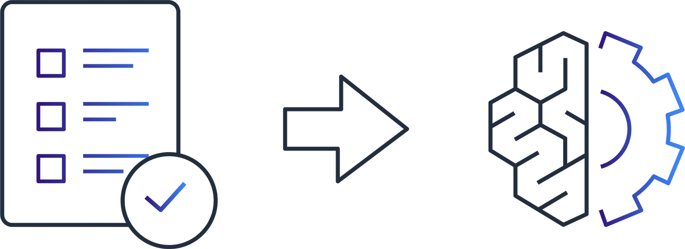
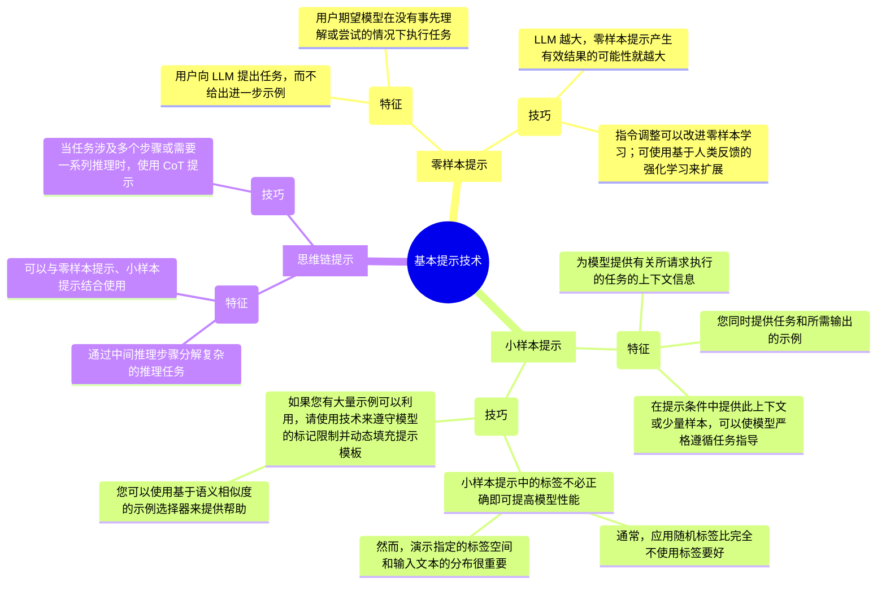

# 基本提示技术

* [零样本提示](#零样本提示)
* [小样本提示](#小样本提示)
* [思维链提示](#思维链提示)

## 零样本提示

**零样本提示**是这样一种提示技术：用户向 LLM 提出任务，而不给出进一步示例。用户期望模型在没有事先理解或尝试的情况下执行任务。现代 LLM 表现出卓越的零样本能力。

使用零样本提示的技巧包括：

* LLM 越大，零样本提示产生有效结果的可能性就越大。
* 指令调整可以改进零样本学习。可使用基于人类反馈的强化学习（RLHF, reinforcement learning from human feedback）来扩展指令调整，使现代 LLM 更好地适应人类偏好。

## 小样本提示

**小样本提示**是这样一种提示技术：您为模型提供有关所请求执行的任务的上下文信息，同时提供任务和所需输出的示例。在提示条件中提供此上下文或少量样本，可以使模型严格遵循任务指导。

使用小样本提示的技巧包括：

* 小样本提示中的标签不必正确即可提高模型性能。通常，应用随机标签比完全不使用标签要好。然而，演示指定的标签空间和输入文本的分布很重要。此上下文中使用的“标签”一词是指提示示例的输出。“提示示例”中的语句所表达的情绪是标签的示例。
* 如果您有大量示例可以利用，请使用技术来遵守模型的标记限制并动态填充提示模板。您可以使用基于语义相似度的示例选择器来提供帮助。

## 思维链提示

**思维链（CoT, chain-of-thought）提示**通过中间推理步骤分解复杂的推理任务。您可以将零样本提示技术和小样本提示技术与 CoT 提示结合使用。

思维链提示特定于问题类型。您可以使用短语“一步一步地思考”在机器学习模型中调用 CoT 推理。

技巧：

* 当任务涉及多个步骤或需要一系列推理时，使用 CoT 提示。

