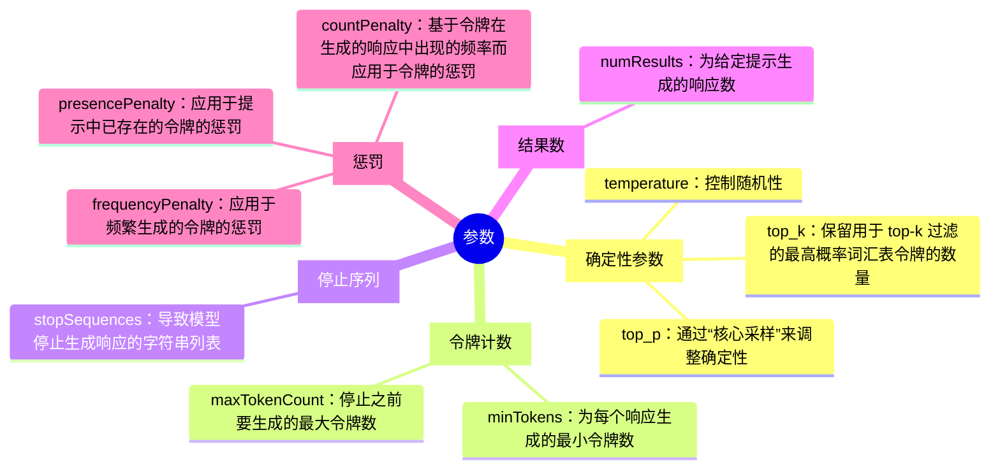
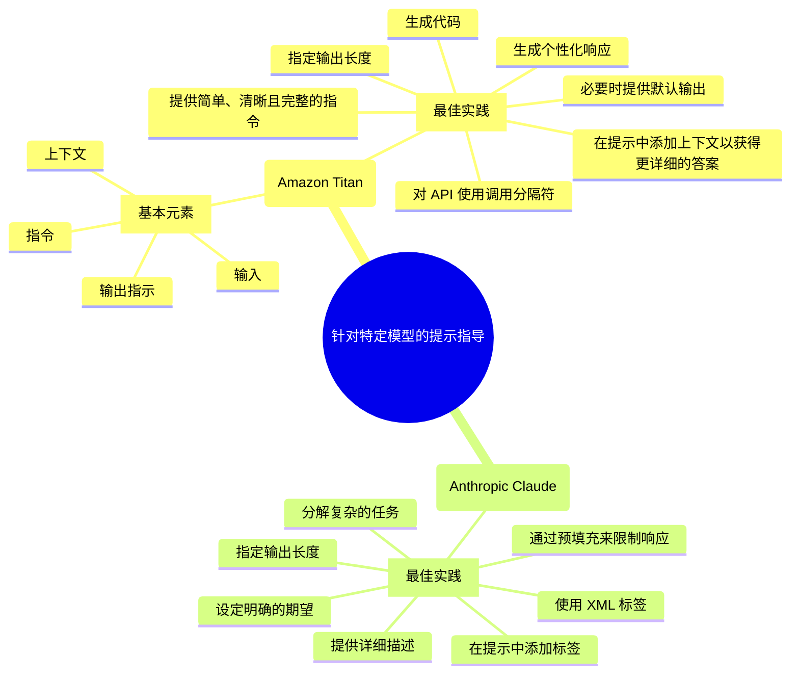

# 特定于模型的提示技术

* [Amazon Titan FM](#amazon-titan-大模型)
* [Anthropic Claude](#anthropic-claude)
* AI21 Jurassic-2

## 参数

以下参数可用于修改 LLM 的输出。并非所有参数都可用于所有 LLM。

* **确定性参数**
    * `temperature`：控制随机性。较低的值侧重于可能的令牌，较高的值会增加随机性和多样性。对事实性响应使用较低的值，对创造性响应使用较高的值。
    * `top_p`：通过“核心采样”来调整确定性。较低的值会给出准确响应，而较高的值会给出多样性响应。此值控制模型响应的多样性。
    * `top_k`：保留用于 top-k 过滤的最高概率词汇表令牌的数量。与 `top_p` 参数类似，`top_k` 定义了模型不再选择单词的截止值。
* **令牌计数**
    * `minTokens`：为每个响应生成的最小令牌数。
    * `maxTokenCount`：停止之前要生成的最大令牌数。
* **停止序列**
    * `stopSequences`：导致模型停止生成响应的字符串列表。
* **结果数**
    * `numResults`：为给定提示生成的响应数。
* **惩罚**
    * `frequencyPenalty`：应用于频繁生成的令牌的惩罚。
    * `presencePenalty`：应用于提示中已存在的令牌的惩罚。
    * `countPenalty`：基于令牌在生成的响应中出现的频率而应用于令牌的惩罚。

### 比较参数

与本节课讨论的三个模型关联的不同参数：

| 模型提供商 | 模型名称 | 参数 |
| --- | --- | --- |
| Amazon | Amazon Titan | `temperature` `topP` `maTokenCount` `stopSequences` |
| Anthropic | Claude | `temperature` `top_p` `top_k` `max_tokens_to_sample` `stop_sequences` |
| AI21 Labs | Jurassic-2 | `temperature` `top_p` `topKReturn` `maxTokens` `stopSequences` numResults `minTokens` `frequencyPenalty` `presencePenalty` `countPenalty` |

## 针对第一方 (1P) 模型的提示指导

### Amazon Titan 大模型

提示的格式取决于预期目的。

基本元素如下：

* **指令**：描述您对模型的要求，例如提供总结或回答问题。
* **上下文**：为模型设置场景，例如提出如下建议：“以下数据是医学文本。”
* **输入**：为总结或检索任务提供实际输入文本。
* **输出指示**：约束模型的输出。例如，您可能希望模型在总结文章时将输出限制为一定数量的单词或句子。

最佳实践：

* **指定输出长度**：要指明您期望在输出中包含的句子、要点和段落的数量。指定特定单词数量不如指定句子、要点和段落的数量有效。
* **提供简单、清晰且完整的指令**：当提示包含对任务的明确预期时，Amazon Titan 会生成最佳响应。
* **在提示中添加上下文以获得更详细的答案**：如果添加上下文并在提示末尾提供指令或输出指示，则将获得更好的结果。
* **必要时提供默认输出**：您可以为模型提供默认输出，以便在模型不确定如何回答时显示。这将防止模型返回听起来正确，但可能答非所问的答案。
* **对 API 使用调用分隔符**：对于 Amazon Titan 模型，在提示末尾添加 `\n`（换行符）很可能会提高模型的性能。对于带有答案选项的分类任务或问题，针对 Titan 模型，还可以用 `\n` 分隔答案选项。
* **生成个性化响应**：您可以通过在提示中注明角色来生成个性化响应。这种提示技术对于生成个性化响应非常有用。
* **生成代码**：您可以生成代码示例，例如 SQL、Python、HTML 或 Java。

## 针对第三方 (3P) 模型的提示指导

### Anthropic Claude

使用 Anthropic Claude 的最佳实践：

* **在提示中添加标签**：引导 Anthropic 模型生成所需的输出；因为 Claude 已经通过 RLHF（基于人类反馈的强化学习）方法进行了训练和微调，所以要在 API 中使用这些提示，以保持“分布”并获得预期结果。
* **提供详细描述**：提供详细的任务描述，包括规则和例外情况；提供示例输入和输出（可选，但可改进格式和准确性）。
* **通过预填充来限制响应**：要限制每个响应中的信息量，您可以自行预填充响应。这有助于 Claude 更快地做出响应，因为处理输入比生成输出更简单。
* **使用 XML 标签**：对于在提示和 Claude 的响应中定义结构非常有用。
    * 如果提示引用一段很长的文本（例如一篇文章），请将指令放在文章之后而不是之前。相关实用技巧：
        1. 您可以要求 Claude 在响应中使用 XML 标签，以便轻松提取关键信息。还可以使用开始 XML 标签结束提示，这是跳过前导码的有效方法。
        2. 您可以使用标签进行小样本学习。
* **指定输出长度**：为获得最佳结果，请指定单词、段落或列表项目的大致数量。要求提供特定数量的字符通常效果较差。
* **设定明确的期望**：确保对 Claude 设定正确的期望，因为模型可能会为您提供与问题无关的信息。如果 Claude 提供幻觉响应，或者错误响应，请尝试更清晰地充分解释任务。这还有助于预测提示中的失败，并解释为什么某个响应会失败。
* **分解复杂的任务**：将复杂任务划分为子任务，将提示分解为多个提示，或询问模型是否理解指令。正如您之前已经学习到，让模型一步一步地思考也可以帮助处理复杂的任务。

