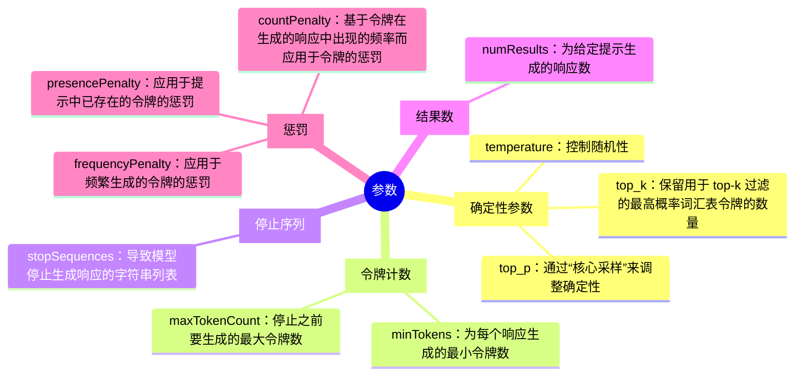

# 特定于模型的提示技术

* Amazon Titan FM
* Anthropic Claude
* AI21 Jurassic-2

## 参数

以下参数可用于修改 LLM 的输出。并非所有参数都可用于所有 LLM。

* **确定性参数**
    * `temperature`：控制随机性。较低的值侧重于可能的令牌，较高的值会增加随机性和多样性。对事实性响应使用较低的值，对创造性响应使用较高的值。
    * `top_p`：通过“核心采样”来调整确定性。较低的值会给出准确响应，而较高的值会给出多样性响应。此值控制模型响应的多样性。
    * `top_k`：保留用于 top-k 过滤的最高概率词汇表令牌的数量。与 `top_p` 参数类似，`top_k` 定义了模型不再选择单词的截止值。
* **令牌计数**
    * `minTokens`：为每个响应生成的最小令牌数。
    * `maxTokenCount`：停止之前要生成的最大令牌数。
* **停止序列**
    * `stopSequences`：导致模型停止生成响应的字符串列表。
* **结果数**
    * `numResults`：为给定提示生成的响应数。
* **惩罚**
    * `frequencyPenalty`：应用于频繁生成的令牌的惩罚。
    * `presencePenalty`：应用于提示中已存在的令牌的惩罚。
    * `countPenalty`：基于令牌在生成的响应中出现的频率而应用于令牌的惩罚。

