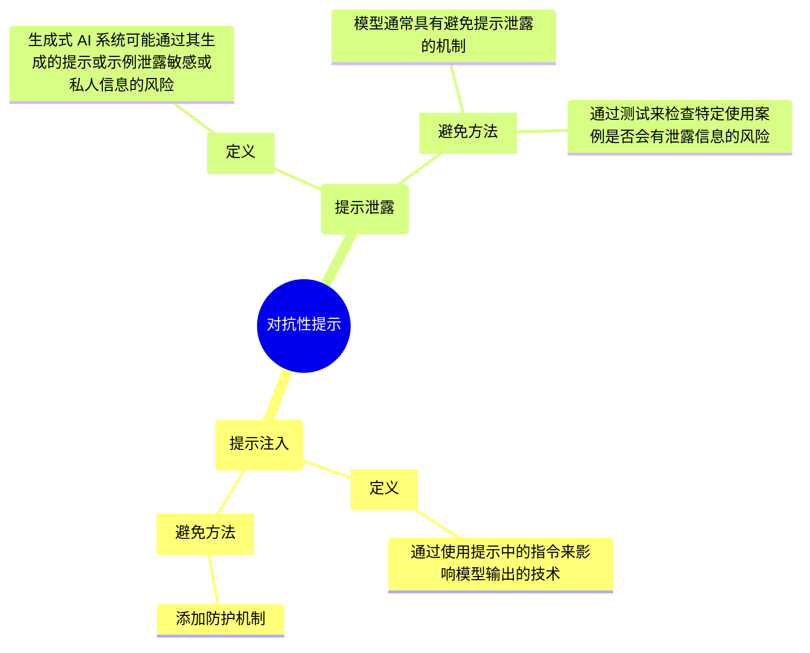

# 解决提示误用问题

两种类型的对抗性提示：

* [提示注入](#提示注入)
* [提示泄露](#提示泄露)

## 提示注入

**提示注入**是一种通过使用提示中的指令来影响模型输出的技术。

* 例如，黑客可能会向文本生成模型提供包含有害、不道德或有偏差的内容的提示，以生成类似的有害、不道德或有偏差的文本。然后，黑客可以使用此文本大规模生成假新闻、教义宣传或其他恶意内容。
* 提示注入还可用于非恶意活动，例如覆盖模型的响应、自定义翻译以保留产品名称等。

为避免提示注入，请尝试在提示中添加**防护机制**。

## 提示泄露

提示泄露是指生成式 AI 系统可能通过其生成的提示或示例泄露敏感或私人信息的风险。

* 例如，如果系统使用私人客户数据进行训练以生成产品建议，则可能会泄露有关客户购物的详细信息。
* 该系统还可能通过为新客户生成的建议泄露有关客户浏览历史记录的详细信息。
* 这可能会侵犯客户的隐私，影响客户对系统的信任。

模型通常具有避免提示泄露的机制。始终建议您进行测试，以仔细检查您的特定使用案例是否可能对模型构成风险，例如暴露私人信息。

