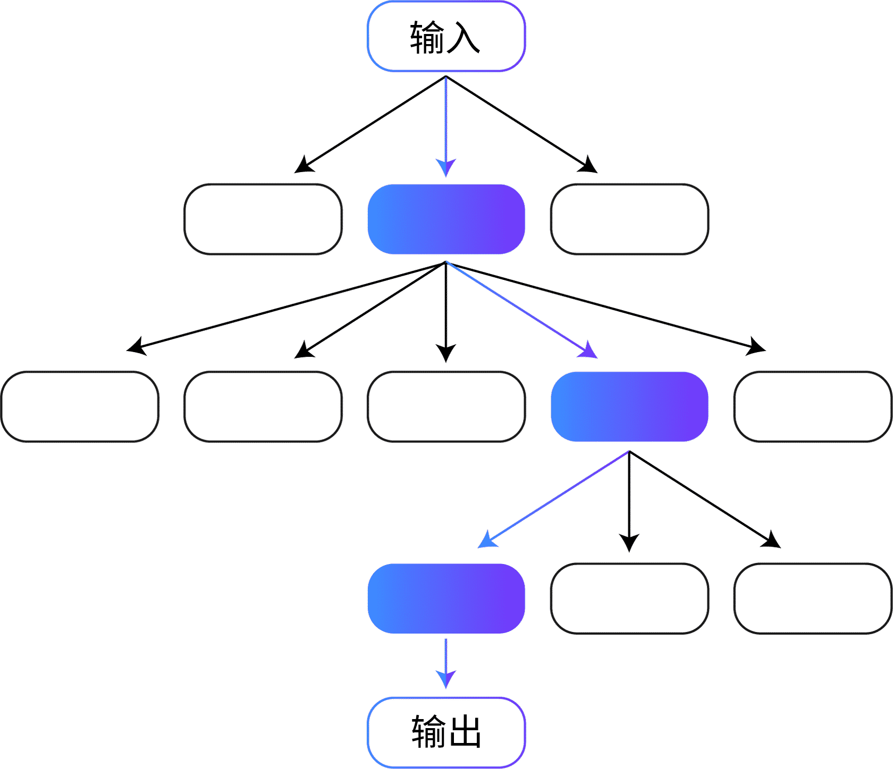
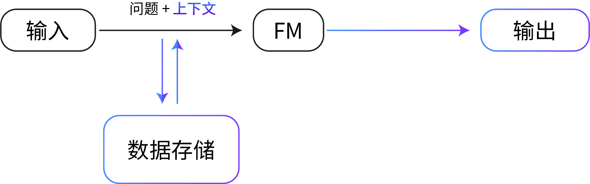
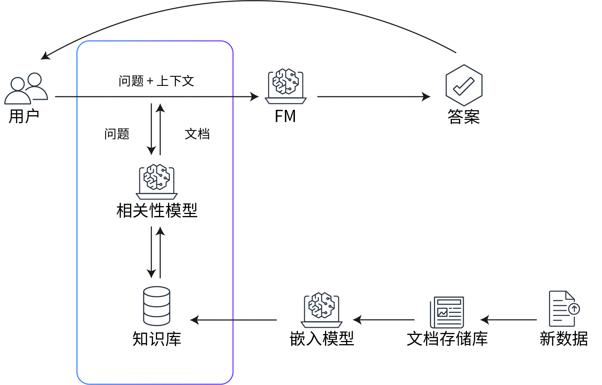
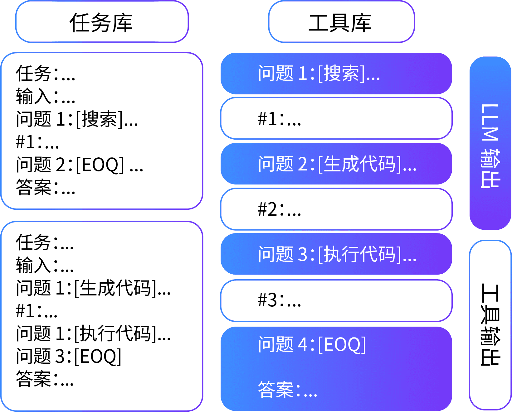

# 高级提示技术

* [自洽性](#自洽性)
* [思维树](#思维树)
* [检索增强生成](#检索增强生成)
* [自动推理和工具使用](#自动推理和工具使用)
* [ReAct 提示](#react-提示)

## 自洽性

**自洽性**是类似思维链的提示技术，但不采用明显的分步路径或贪婪路径，而是提示模型对各种推理路径进行采样，然后模型根据来自各个路径的多个数据点聚合最终答案。

* 当用于一系列常见算术和常识推理基准时，自洽性可以改进 CoT 推理提示。

## 思维树

**思维树 (ToT, Tree of thoughts)** 是另一种基于 CoT 提示技术的技术。CoT 提示按顺序对思维进行采样，但 ToT 提示遵循树分支技术。通过 ToT 技术，LLM 可以采用细致入微的方式学习，考虑多条路径而不是一条顺序路径。

* 对于涉及重要初始决策、未来策略和探索多种解决方案的任务，ToT 提示是一种特别有效的方法。大多数 LLM 通过遵循标准的从左到右的标记级推理来做出决策，但通过 ToT，LLM 可以自行评估选择。
* ToT 可以显著提高模型处理需要重要规划的任务时的性能。

## 检索增强生成

**检索增强生成 (RAG, Retrieval Augmented Generation)** 是一种提示技术，它提供领域相关的数据作为上下文，以基于这些数据和提示生成响应。该技术类似于微调。然而，RAG 不必使用一小组标注示例对 FM 进行微调，而是从大型语料库中检索一小组相关文档，并使用这些文档提供上下文来回答问题。RAG 不会改变基础模型的权重，而微调会改变模型权重。

这种方法比常规微调更具成本效益，因为 RAG 方法不会产生对模型进行微调的成本。RAG 还解决了数据频繁更改带来的挑战，因为它会检索更新的相关信息，而不是依赖可能过时的数据集。

在 RAG 中，外部数据可以来自多个数据源，例如文档存储库、数据库或 API。在将 RAG 用于 LLM 之前，您必须准备知识库并使其保持最新。

在 LLM 中使用 RAG 的概念化流程：

1. 使用 GPT-J 或 Amazon Titan Embeddings 等语言模型对输入文本进行编码。
2. 从知识库中检索与输入匹配的相关示例。这些示例将以相同的方式进行编码。
3. 向基础模型提供包含问题和上下文的增强提示以生成响应。
4. 生成的响应以输入和检索到的示例为条件，将来自多个相关示例的信息合并到响应中。

## 自动推理和工具使用

与自洽性和 ToT 提示技术一样，**ART** 是一种基于思维链过程的提示技术，可专门用于多步推理任务。

该技术本质上是通过让模型从任务库中选择多个或少量示例的演示来解构复杂的任务。在模型使用这种小样本分解的同时，它使用预定义的外部工具（例如搜索和代码生成）来执行任务。

对于未见过的任务，ART 的表现明显优于小样本提示和自动 CoT，并且在大多数任务中，它的表现与手动 CoT 提示相当。使用 ART，人类还能够更高效地更新任务库中的信息，从而纠正错误并最终提高性能。

## ReAct 提示

在 **ReAct 提示**中，LLM 可以将推理和动作结合起来。模型通常用于推理或动作，但并不总是能同时有效地用于这两者。

CoT 提示表明 LLM 有望为简单的任务进行推理和生成动作。但是，无法在 CoT 提示下更新信息或访问外部上下文，可能会导致输出发生事实幻觉等错误。借助 ReAct 框架，LLM 可以生成基于外部工具的推理跟踪和特定于任务的动作。这种外部上下文可产生更准确可靠的输出。

## 相关链接

* [“利用自洽性提高语言模型中的思维链推理效果” (Self-Consistency Improves Chain of Thought Reasoning in Language Models)](https://arxiv.org/abs/2203.11171)
* [“思维树：让大型语言模型深思熟虑地解决问题” (Tree of Thoughts: Deliberate Problem Solving with Large Language Models)](https://arxiv.org/abs/2305.10601)
* [“知识密集型 NLP 任务中的检索增强生成”(Retrieval-Augmented Generation for Knowledge-Intensive NLP Tasks)](https://arxiv.org/abs/2005.11401)
* [“ART：大语言模型的自动多步推理和工具使用”(ART: Automatic multi-step reasoning and tool-use for large language models)](https://arxiv.org/abs/2303.09014)
* [“ReAct：语言模型中推理和动作的协同作用”(ReAct: Synergizing Reasoning and Acting in Language Models)](https://arxiv.org/abs/2210.03629)