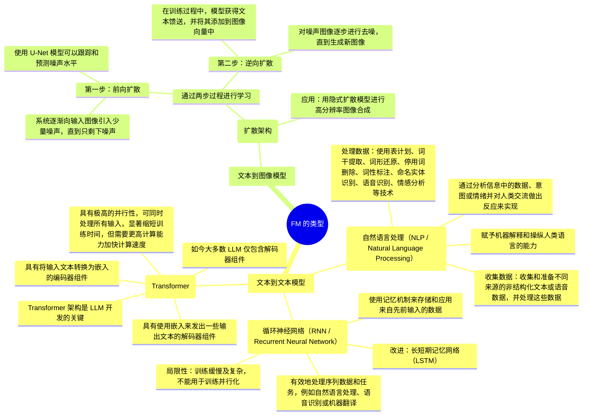

# 基础模型的基础知识

## 了解基础模型 (FM) 功能

### 自监督学习

* 不需要标注示例
* 利用数据内的结构自动生成标签

### 训练、微调和提示调整

1. 预训练
2. 微调
3. 提示工程

## FM 的类型

* 文本到文本模型
    * 自然语言处理（NLP / Natural Language Processing）
    * 循环神经网络（RNN / Recurrent Neural Network）
    * Transformer
* 文本到图像模型
    * 扩散架构

