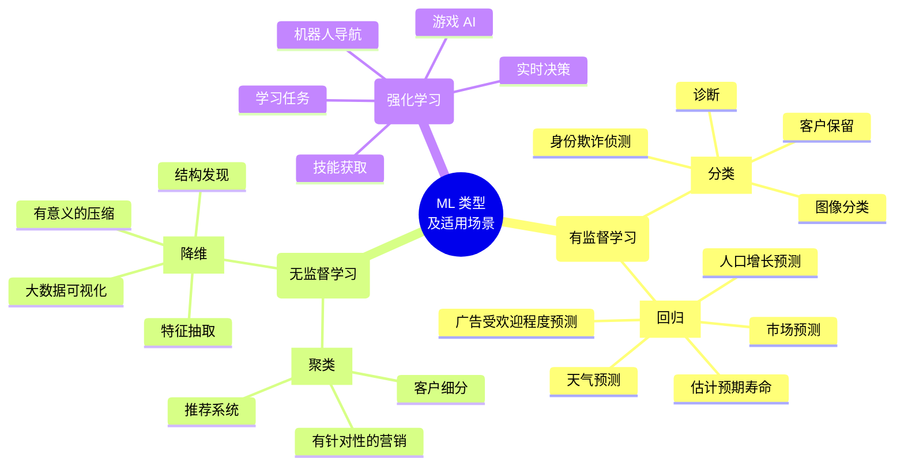
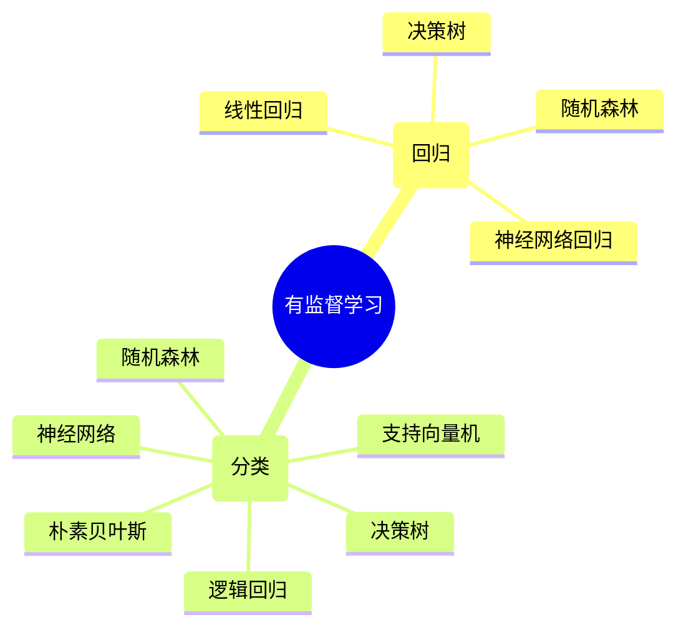
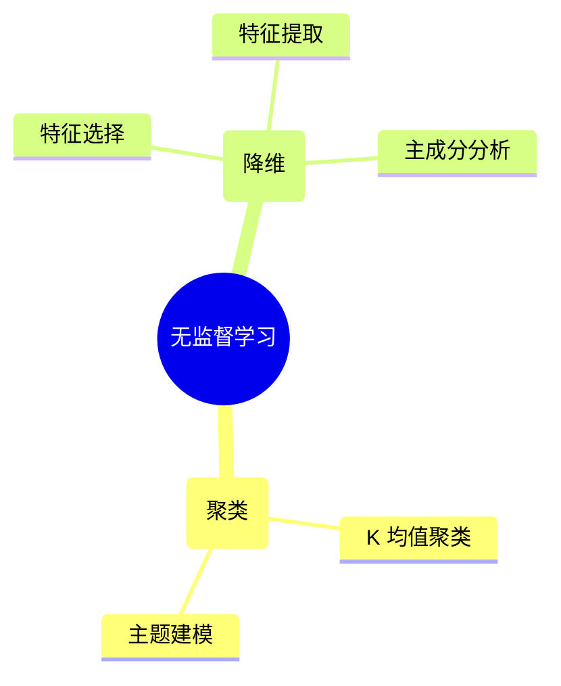

# 模块 1：机器学习简介

## 概览

本课程学习目标：

* 描述基本的机器学习 (ML) 概念和技术。
* 描述传统的 ML 方法：有监督学习、无监督学习和强化学习。
* 确定 ML 生命周期及其阶段。
* 解释业务审查以及 ML 适用场景。
* 描述数据准备挑战。
* 确定构建 ML 模型的步骤。
* 描述用于衡量模型预测准确率的指标。

## ML 基本知识

### ML 是什么

机器学习 (ML) 是一种人工智能 (AI)，用于理解和构建使机器可以进行学习的方法。这些方法使用数据来提高一组任务的计算机性能。

科学家将 ML 视为 AI 的一个广泛分支。ML 算法根据样本数据（称为“训练数据”）构建模型，以便在未明确编程的情况下做出预测或决策。

在难以甚至无法开发传统算法来执行所需任务的情况下，很多应用程序都使用 ML 算法。其中包括电子邮件过滤、语音识别和计算机视觉应用程序。

### ML 发展历史

### ML 类型

* [有监督学习](#有监督学习)
* [无监督学习](#无监督学习)
* [强化学习](#强化学习)

#### 有监督学习

**有监督学习**使用训练数据来示教模型，以生成所需的输出。训练数据包括帮助模型学习的输入和正确输出。

有监督学习的问题示例：

* **回归**

    在**回归**中，问题在于预测连续值。您可以使用不同的方法来了解特征（自变量）和结果（因变量）之间的关系。这些方法包括：

    * **线性回归**，用于在给定自变量的值的情况下，预测因变量的值。它使用拟合到数据点图的直线。
    * **决策树**，用作预测模型，以得出关于一组观察结果的结论。
    * **随机森林**，是决策树的大集合。对于回归任务，将返回单个树的平均预测。
    * **神经网络回归**，是一种利用人工神经网络对连续数值进行建模和预测的技术。
* **分类**

    在**分类**中，问题在于预测项目是否属于特定类别或类。您可以使用不同的预测建模方法，对输入数据的特定示例预测类标签。这些方法包括：

    * **逻辑回归**，用于根据给定的自变量数据集估计事件发生的概率。预测通常具有二元结果，例如 1 或 0、是或否、真或假、阳性或阴性。
    * **支持向量机**，是具有关联学习算法的有监督学习模型，用于分析数据以进行分类和回归分析。
    * **朴素贝叶斯**，是一种基于贝叶斯定理的算法，以托马斯·贝叶斯的名字命名，它描述了事件的概率。它对给定类变量的每对特征之间的条件独立性作了朴素的假设。

    **您还可以使用决策树、随机森林和神经网络，它们对聚类的定义与对回归的定义相同。**

#### 无监督学习

在**无监督学习**模型中，没有为学习算法提供标签，需要算法自己在输入中找出结构。无监督学习本身可以是一个目标（发现数据中隐藏的模式），也可以是达到目的的一种手段（特征学习）。

**无监督学习**是指在未标注的数据中学习模式的算法。在有监督学习中，模型学习将输入映射到目标输出，例如标注为猫或鱼的图像。无监督方法学习输入数据的简明表示，可用于数据探索或者分析或生成新数据。

无监督学习的问题示例：

* **聚类**

    在**聚类**，挑战在于将对象组织成具有相似属性的成员组（或簇），然后描述簇的特征。 聚类的一些方法包括：

    * **K 均值聚类**，这是一种基于质心的聚类算法。这种算法会计算每个数据点与质心之间的距离，以将数据点分配到簇。
    * **主题建模**方法，用于发现假定已生成主题簇的常用主题。
* **降维**

    具有大量特征的训练模型成本高昂，而且更容易过拟合。降维可最大限度地减少有代表性或有影响力的特征的数量。

    有以下两种方法可用来执行降维：

    * 使用**特征选择**来识别影响最小或无影响的特征。（您可以不考虑这些特征。）
    * 使用**特征提取**来获取具有同等表现力的特征（原始特征的组合）。

    对于降维，您可以使用**主成分分析 (PCA)**。这是一种将高维数据转换为低维数据，同时保留尽可能多的信息的技术。

#### 强化学习

在**强化学习中**，仅向机器提供性能分数作为指导和半监督学习，其中仅标注一部分训练数据。

挑战示例：

* 计算机程序与动态环境交互以完成特定任务，例如操作车辆或参与游戏比赛。该程序在遍历其问题空间时接收类似于激励的输入，然后致力于实现优化。

### ML 使用案例

* **自然语言处理**
    * 挖掘业务和呼叫中心分析
    * 对产品评论建立索引并进行搜索
    * 管理法律简要
    * 处理财务文件
* **图像和视频分析**
    * 检测不当内容
    * 验证在线身份
    * 简化媒体分析
    * 发送互联智能家居警报
* **金融服务**
    * 风险分析和监管
    * 客户细分
    * 交叉销售和追加销售
    * 销售和营销活动管理
    * 资信评估
* **医疗保健与生命科学**
    * 来自实时患者数据的警报和诊断
    * 疾病识别和风险满意度
    * 患者分诊优化
    * 主动健康管理
    * 医疗保健提供商情绪分析
* **制造**
    * 预测性维护或状况监控
    * 保证金估算
    * 购买倾向
    * 需求预测
    * 流程优化
* **自动驾驶汽车系统**
    * 高级辅助驾驶系统（ADAS）
    * 自动驾驶
    * 车载娱乐体验
* **推荐系统**
    * 优化建议
    * 更准确地定位客户
    * 充分发挥数据的价值
    * 利用业务规则推广产品
* **零售**
    * 预测性库存规划
    * 追加销售和跨渠道营销
    * 市场细分和定位
    * 客户投资回报率（ROI）和生命周期价值
* **旅游与酒店**
    * 飞机调度
    * 动态定价
    * 社交媒体客户反馈和互动
    * 客户投诉解决
    * 交通模式和拥塞管理
* **能源**
    * 功耗分析
    * 地震数据处理
    * 碳排放与交易
    * 客户特定定价
    * “智能电网”管理
    * 能源需求与供给优化

## ML 可以解决的问题

### 业务案例评估

1. **确定 ML 是否合适**：开始审查时，首先要确定 ML 是否是实现业务目标的合适方法。
2. **评估实现目标的选项**：评估可用于实现目标的所有选项。
3. **考虑准确率、成本和可扩展性**：确定结果的准确率，同时考虑每种方法的成本和可扩展性。
4. **确保训练数据符合要求**：为使基于 ML 的方法取得成功，请确保为算法提供足够的高质量相关训练数据。
5. **评估可用的数据源**：仔细评估数据，确保正确的数据源可用且可访问。

ML 业务审查中必须考虑的步骤：

1. 了解业务需求。
2. 形成业务问题。
3. 审查项目的 ML 可行性和数据要求。
4. 评估数据采集、训练、推理和错误预测的成本。
5. 查看类似领域中经过验证或已发布的工作成果（若有）。
6. 确定关键绩效指标，包括可接受的错误。
7. 根据业务问题定义机器学习任务。
8. 确定必须具备的关键特征。
9. 设计小规模的、重点突出的小型概念验证 (POC)，以验证此列表中的所有上述项目。
10. 评估引入外部数据源是否会提高模型性能。
11. 制定生产路线。
12. 考虑实施过程中可能出现的新业务流程。
13. 使相关的利益攸关方与计划保持一致。

### ML 适用场景

* **无法将规则编写成代码**：许多人工任务无法使用基于规则的简单（确定性）方案来解决。影响答案的因素有很多。如果规则取决于太多因素、重叠或者需要非常精细地调整，就会难以通过人力来准确地将这些规则编写成代码。您可以使用 ML 有效解决这个问题。
* **无法扩展**：数量太大、无法通过人力处理的问题，可以使用 ML 解决方案有效处理大规模问题。

## ML 生命周期

生成和运行典型的 ML 工作负载是一种由多个阶段组成的迭代过程。ML 流程包括以下考虑因素：

* 业务目标识别
* ML 问题界定
* 数据收集
* 数据集成和准备
* 特征工程
* 模型训练
* 模型验证
* 业务评估
* 生产部署（模型部署和模型推理）

ML 生命周期阶段：

1. **项目范围**

    利用项目范围阶段完成以下任务：

    * 定义业务使用案例
    * 定义 ML 问题框架
    * 让业务负责人和领域专家参与进来
2. **数据准备**

    利用数据准备阶段完成以下任务：

    * 数据摄取
    * 数据探索和清理
    * 特征工程和选择
    * 让数据工程师和数据科学家参与进来
3. **模型开发**

    利用模型开发阶段完成以下任务：

    * 模型实验和训练
    * 模型测试
    * 模型评估
    * 让数据科学家参与进来
4. **模型部署**

    利用模型部署阶段完成以下任务：

    * 持续集成和持续交付 (CI/CD)
    * 版本控制
    * 批量和实时预测
    * 让开发运维 (DevOps) 和数据科学家参与进来
5. **模型监控和维护**

    利用模型监控和维护阶段完成以下任务：

    * 漂移检测
    * 定义保留目标
    * 警报和日志记录
    * 让 DevOps 和数据科学家参与进来

### ML 运维和工作流

三组利益攸关方：

<table>
    <thead>
        <tr>
            <th>利益攸关方</th>
            <th>任务</th>
        </tr>
    </thead>
    <tbody>
        <tr>
            <td>开发</td>
            <td>
                <ul>
                    <li>数据提取</li>
                    <li>数据清理和处理</li>
                    <li>特征工程</li>
                    <li>模型训练和评估</li>
                    <li>模型审查和批准</li>
                </ul>
            </td>
        </tr>
        <tr>
            <td>生产准备</td>
            <td>
                <ul>
                    <li>开发基础设施和资源</li>
                    <li>质量保证和测试</li>
                    <li>容器化</li>
                    <li>CI / CD</li>
                    <li>发送以供发布审批</li>
                </ul>
            </td>
        </tr>
        <tr>
            <td>生产</td>
            <td>
                <ul>
                    <li>推理服务</li>
                    <li>日志记录和警报</li>
                    <li>监控数据和模型性能</li>
                    <li>再训练目标</li>
                </ul>
            </td>
        </tr>
    </tbody>
</table>

### MLOps 的益处

1. **可重复性**：自动化机器学习开发生命周期 (MLDC) 中的所有步骤有助于确保流程可重复。可重复的流程包括如何对模型进行训练、评估、版本控制和部署。
2. **可审计性**：您可以对从数据科学实验到源数据再到经过训练的模型的所有输入和输出进行版本控制。这样，您就可以准确地演示模型的构建方式和部署位置。
3. **生产效率**：提供支持访问经策管数据集的自助服务环境可帮助数据工程师和数据科学家更快地采取行动，并减少因数据丢失或无效而浪费的时间。
4. **可靠性**：通过采用 CI/CD 实践，您可以快速部署并提高质量和一致性。
5. **数据和模型质量**：借助 MLOps，您可以实施策略来防范模型偏差。它会跟踪数据统计属性和模型质量随时间的变化。
