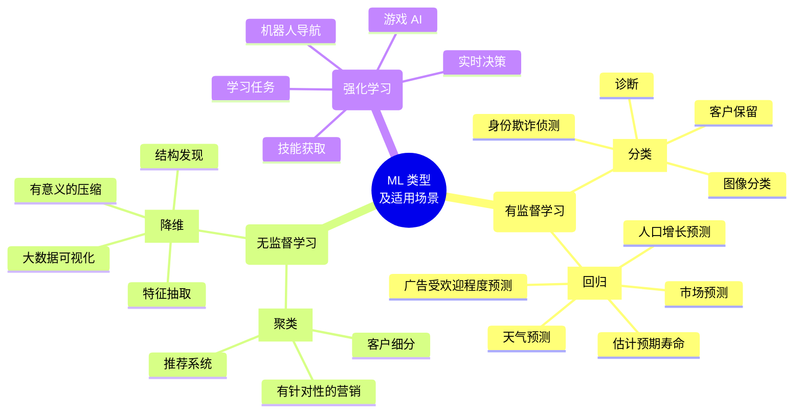
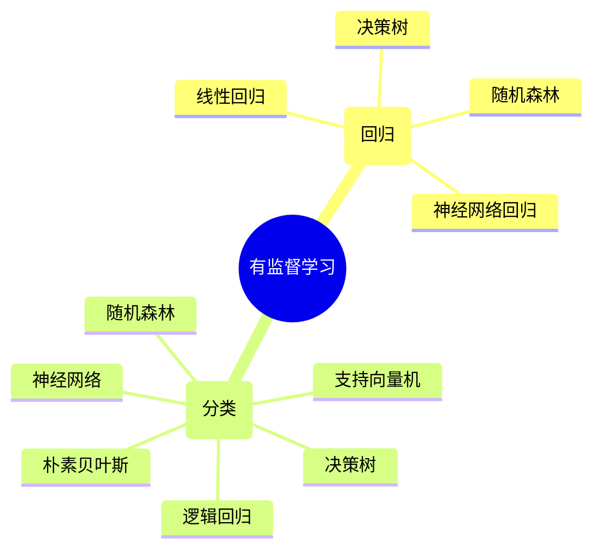
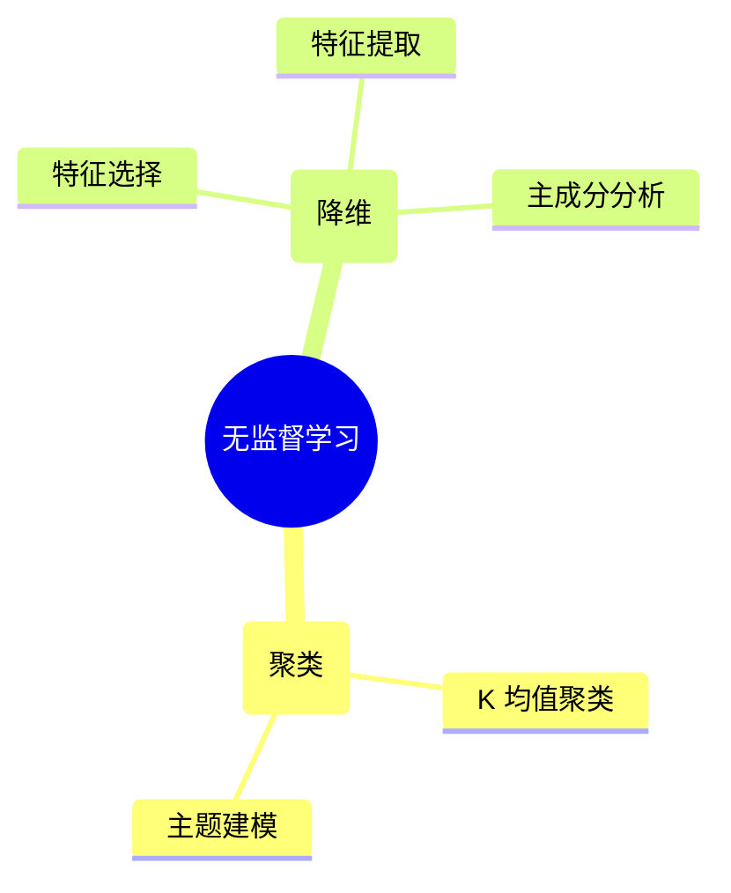

# 模块 1：机器学习简介

## 概览

本课程学习目标：

* 描述基本的机器学习 (ML) 概念和技术。
* 描述传统的 ML 方法：有监督学习、无监督学习和强化学习。
* 确定 ML 生命周期及其阶段。
* 解释业务审查以及 ML 适用场景。
* 描述数据准备挑战。
* 确定构建 ML 模型的步骤。
* 描述用于衡量模型预测准确率的指标。

## ML 基本知识

### ML 是什么

机器学习 (ML) 是一种人工智能 (AI)，用于理解和构建使机器可以进行学习的方法。这些方法使用数据来提高一组任务的计算机性能。

科学家将 ML 视为 AI 的一个广泛分支。ML 算法根据样本数据（称为“训练数据”）构建模型，以便在未明确编程的情况下做出预测或决策。

在难以甚至无法开发传统算法来执行所需任务的情况下，很多应用程序都使用 ML 算法。其中包括电子邮件过滤、语音识别和计算机视觉应用程序。

### ML 发展历史

### ML 类型

* [有监督学习](#有监督学习)
* [无监督学习](#无监督学习)
* [强化学习](#强化学习)

#### 有监督学习

**有监督学习**使用训练数据来示教模型，以生成所需的输出。训练数据包括帮助模型学习的输入和正确输出。

有监督学习的问题示例：

* **回归**

    在**回归**中，问题在于预测连续值。您可以使用不同的方法来了解特征（自变量）和结果（因变量）之间的关系。这些方法包括：

    * **线性回归**，用于在给定自变量的值的情况下，预测因变量的值。它使用拟合到数据点图的直线。
    * **决策树**，用作预测模型，以得出关于一组观察结果的结论。
    * **随机森林**，是决策树的大集合。对于回归任务，将返回单个树的平均预测。
    * **神经网络回归**，是一种利用人工神经网络对连续数值进行建模和预测的技术。
* **分类**

    在**分类**中，问题在于预测项目是否属于特定类别或类。您可以使用不同的预测建模方法，对输入数据的特定示例预测类标签。这些方法包括：

    * **逻辑回归**，用于根据给定的自变量数据集估计事件发生的概率。预测通常具有二元结果，例如 1 或 0、是或否、真或假、阳性或阴性。
    * **支持向量机**，是具有关联学习算法的有监督学习模型，用于分析数据以进行分类和回归分析。
    * **朴素贝叶斯**，是一种基于贝叶斯定理的算法，以托马斯·贝叶斯的名字命名，它描述了事件的概率。它对给定类变量的每对特征之间的条件独立性作了朴素的假设。

    **您还可以使用决策树、随机森林和神经网络，它们对聚类的定义与对回归的定义相同。**

#### 无监督学习

在**无监督学习**模型中，没有为学习算法提供标签，需要算法自己在输入中找出结构。无监督学习本身可以是一个目标（发现数据中隐藏的模式），也可以是达到目的的一种手段（特征学习）。

**无监督学习**是指在未标注的数据中学习模式的算法。在有监督学习中，模型学习将输入映射到目标输出，例如标注为猫或鱼的图像。无监督方法学习输入数据的简明表示，可用于数据探索或者分析或生成新数据。

无监督学习的问题示例：

* **聚类**

    在**聚类**，挑战在于将对象组织成具有相似属性的成员组（或簇），然后描述簇的特征。 聚类的一些方法包括：

    * **K 均值聚类**，这是一种基于质心的聚类算法。这种算法会计算每个数据点与质心之间的距离，以将数据点分配到簇。
    * **主题建模**方法，用于发现假定已生成主题簇的常用主题。
* **降维**

    具有大量特征的训练模型成本高昂，而且更容易过拟合。降维可最大限度地减少有代表性或有影响力的特征的数量。

    有以下两种方法可用来执行降维：

    * 使用**特征选择**来识别影响最小或无影响的特征。（您可以不考虑这些特征。）
    * 使用**特征提取**来获取具有同等表现力的特征（原始特征的组合）。

    对于降维，您可以使用**主成分分析 (PCA)**。这是一种将高维数据转换为低维数据，同时保留尽可能多的信息的技术。

#### 强化学习

在**强化学习中**，仅向机器提供性能分数作为指导和半监督学习，其中仅标注一部分训练数据。

挑战示例：

* 计算机程序与动态环境交互以完成特定任务，例如操作车辆或参与游戏比赛。该程序在遍历其问题空间时接收类似于激励的输入，然后致力于实现优化。