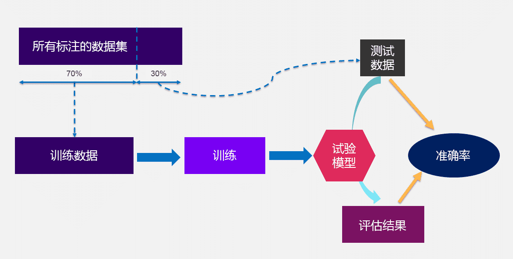

# 模块 1：机器学习简介

## 概览

本课程学习目标：

* 描述基本的机器学习 (ML) 概念和技术。
* 描述传统的 ML 方法：有监督学习、无监督学习和强化学习。
* 确定 ML 生命周期及其阶段。
* 解释业务审查以及 ML 适用场景。
* 描述数据准备挑战。
* 确定构建 ML 模型的步骤。
* 描述用于衡量模型预测准确率的指标。

## ML 基本知识

### ML 是什么

机器学习 (ML) 是一种人工智能 (AI)，用于理解和构建使机器可以进行学习的方法。这些方法使用数据来提高一组任务的计算机性能。

科学家将 ML 视为 AI 的一个广泛分支。ML 算法根据样本数据（称为“训练数据”）构建模型，以便在未明确编程的情况下做出预测或决策。

在难以甚至无法开发传统算法来执行所需任务的情况下，很多应用程序都使用 ML 算法。其中包括电子邮件过滤、语音识别和计算机视觉应用程序。

### ML 发展历史

### ML 类型

* [有监督学习](#有监督学习)
* [无监督学习](#无监督学习)
* [强化学习](#强化学习)

#### 有监督学习

**有监督学习**使用训练数据来示教模型，以生成所需的输出。训练数据包括帮助模型学习的输入和正确输出。

有监督学习的问题示例：

* **回归**

    在**回归**中，问题在于预测连续值。您可以使用不同的方法来了解特征（自变量）和结果（因变量）之间的关系。这些方法包括：

    * **线性回归**，用于在给定自变量的值的情况下，预测因变量的值。它使用拟合到数据点图的直线。
    * **决策树**，用作预测模型，以得出关于一组观察结果的结论。
    * **随机森林**，是决策树的大集合。对于回归任务，将返回单个树的平均预测。
    * **神经网络回归**，是一种利用人工神经网络对连续数值进行建模和预测的技术。
* **分类**

    在**分类**中，问题在于预测项目是否属于特定类别或类。您可以使用不同的预测建模方法，对输入数据的特定示例预测类标签。这些方法包括：

    * **逻辑回归**，用于根据给定的自变量数据集估计事件发生的概率。预测通常具有二元结果，例如 1 或 0、是或否、真或假、阳性或阴性。
    * **支持向量机**，是具有关联学习算法的有监督学习模型，用于分析数据以进行分类和回归分析。
    * **朴素贝叶斯**，是一种基于贝叶斯定理的算法，以托马斯·贝叶斯的名字命名，它描述了事件的概率。它对给定类变量的每对特征之间的条件独立性作了朴素的假设。

    **您还可以使用决策树、随机森林和神经网络，它们对聚类的定义与对回归的定义相同。**

#### 无监督学习

在**无监督学习**模型中，没有为学习算法提供标签，需要算法自己在输入中找出结构。无监督学习本身可以是一个目标（发现数据中隐藏的模式），也可以是达到目的的一种手段（特征学习）。

**无监督学习**是指在未标注的数据中学习模式的算法。在有监督学习中，模型学习将输入映射到目标输出，例如标注为猫或鱼的图像。无监督方法学习输入数据的简明表示，可用于数据探索或者分析或生成新数据。

无监督学习的问题示例：

* **聚类**

    在**聚类**，挑战在于将对象组织成具有相似属性的成员组（或簇），然后描述簇的特征。 聚类的一些方法包括：

    * **K 均值聚类**，这是一种基于质心的聚类算法。这种算法会计算每个数据点与质心之间的距离，以将数据点分配到簇。
    * **主题建模**方法，用于发现假定已生成主题簇的常用主题。
* **降维**

    具有大量特征的训练模型成本高昂，而且更容易过拟合。降维可最大限度地减少有代表性或有影响力的特征的数量。

    有以下两种方法可用来执行降维：

    * 使用**特征选择**来识别影响最小或无影响的特征。（您可以不考虑这些特征。）
    * 使用**特征提取**来获取具有同等表现力的特征（原始特征的组合）。

    对于降维，您可以使用**主成分分析 (PCA)**。这是一种将高维数据转换为低维数据，同时保留尽可能多的信息的技术。

#### 强化学习

在**强化学习中**，仅向机器提供性能分数作为指导和半监督学习，其中仅标注一部分训练数据。

挑战示例：

* 计算机程序与动态环境交互以完成特定任务，例如操作车辆或参与游戏比赛。该程序在遍历其问题空间时接收类似于激励的输入，然后致力于实现优化。

### ML 使用案例

* **自然语言处理**
    * 挖掘业务和呼叫中心分析
    * 对产品评论建立索引并进行搜索
    * 管理法律简要
    * 处理财务文件
* **图像和视频分析**
    * 检测不当内容
    * 验证在线身份
    * 简化媒体分析
    * 发送互联智能家居警报
* **金融服务**
    * 风险分析和监管
    * 客户细分
    * 交叉销售和追加销售
    * 销售和营销活动管理
    * 资信评估
* **医疗保健与生命科学**
    * 来自实时患者数据的警报和诊断
    * 疾病识别和风险满意度
    * 患者分诊优化
    * 主动健康管理
    * 医疗保健提供商情绪分析
* **制造**
    * 预测性维护或状况监控
    * 保证金估算
    * 购买倾向
    * 需求预测
    * 流程优化
* **自动驾驶汽车系统**
    * 高级辅助驾驶系统（ADAS）
    * 自动驾驶
    * 车载娱乐体验
* **推荐系统**
    * 优化建议
    * 更准确地定位客户
    * 充分发挥数据的价值
    * 利用业务规则推广产品
* **零售**
    * 预测性库存规划
    * 追加销售和跨渠道营销
    * 市场细分和定位
    * 客户投资回报率（ROI）和生命周期价值
* **旅游与酒店**
    * 飞机调度
    * 动态定价
    * 社交媒体客户反馈和互动
    * 客户投诉解决
    * 交通模式和拥塞管理
* **能源**
    * 功耗分析
    * 地震数据处理
    * 碳排放与交易
    * 客户特定定价
    * “智能电网”管理
    * 能源需求与供给优化

## ML 可以解决的问题

### 业务案例评估

1. **确定 ML 是否合适**：开始审查时，首先要确定 ML 是否是实现业务目标的合适方法。
2. **评估实现目标的选项**：评估可用于实现目标的所有选项。
3. **考虑准确率、成本和可扩展性**：确定结果的准确率，同时考虑每种方法的成本和可扩展性。
4. **确保训练数据符合要求**：为使基于 ML 的方法取得成功，请确保为算法提供足够的高质量相关训练数据。
5. **评估可用的数据源**：仔细评估数据，确保正确的数据源可用且可访问。

ML 业务审查中必须考虑的步骤：

1. 了解业务需求。
2. 形成业务问题。
3. 审查项目的 ML 可行性和数据要求。
4. 评估数据采集、训练、推理和错误预测的成本。
5. 查看类似领域中经过验证或已发布的工作成果（若有）。
6. 确定关键绩效指标，包括可接受的错误。
7. 根据业务问题定义机器学习任务。
8. 确定必须具备的关键特征。
9. 设计小规模的、重点突出的小型概念验证 (POC)，以验证此列表中的所有上述项目。
10. 评估引入外部数据源是否会提高模型性能。
11. 制定生产路线。
12. 考虑实施过程中可能出现的新业务流程。
13. 使相关的利益攸关方与计划保持一致。

### ML 适用场景

* **无法将规则编写成代码**：许多人工任务无法使用基于规则的简单（确定性）方案来解决。影响答案的因素有很多。如果规则取决于太多因素、重叠或者需要非常精细地调整，就会难以通过人力来准确地将这些规则编写成代码。您可以使用 ML 有效解决这个问题。
* **无法扩展**：数量太大、无法通过人力处理的问题，可以使用 ML 解决方案有效处理大规模问题。

## ML 生命周期

生成和运行典型的 ML 工作负载是一种由多个阶段组成的迭代过程。ML 流程包括以下考虑因素：

* 业务目标识别
* ML 问题界定
* 数据收集
* 数据集成和准备
* 特征工程
* 模型训练
* 模型验证
* 业务评估
* 生产部署（模型部署和模型推理）

ML 生命周期阶段：

1. **项目范围**

    利用项目范围阶段完成以下任务：

    * 定义业务使用案例
    * 定义 ML 问题框架
    * 让业务负责人和领域专家参与进来
2. **数据准备**

    利用数据准备阶段完成以下任务：

    * 数据摄取
    * 数据探索和清理
    * 特征工程和选择
    * 让数据工程师和数据科学家参与进来
3. **模型开发**

    利用模型开发阶段完成以下任务：

    * 模型实验和训练
    * 模型测试
    * 模型评估
    * 让数据科学家参与进来
4. **模型部署**

    利用模型部署阶段完成以下任务：

    * 持续集成和持续交付 (CI/CD)
    * 版本控制
    * 批量和实时预测
    * 让开发运维 (DevOps) 和数据科学家参与进来
5. **模型监控和维护**

    利用模型监控和维护阶段完成以下任务：

    * 漂移检测
    * 定义保留目标
    * 警报和日志记录
    * 让 DevOps 和数据科学家参与进来

### ML 运维和工作流

三组利益攸关方：

1. 开发
2. 生产准备
3. 生产

<table>
    <thead>
        <tr>
            <th>利益攸关方</th>
            <th>任务</th>
        </tr>
    </thead>
    <tbody>
        <tr>
            <td>开发</td>
            <td>
                <ul>
                    <li>数据提取</li>
                    <li>数据清理和处理</li>
                    <li>特征工程</li>
                    <li>模型训练和评估</li>
                    <li>模型审查和批准</li>
                </ul>
            </td>
        </tr>
        <tr>
            <td>生产准备</td>
            <td>
                <ul>
                    <li>开发基础设施和资源</li>
                    <li>质量保证和测试</li>
                    <li>容器化</li>
                    <li>CI / CD</li>
                    <li>发送以供发布审批</li>
                </ul>
            </td>
        </tr>
        <tr>
            <td>生产</td>
            <td>
                <ul>
                    <li>推理服务</li>
                    <li>日志记录和警报</li>
                    <li>监控数据和模型性能</li>
                    <li>再训练目标</li>
                </ul>
            </td>
        </tr>
    </tbody>
</table>

### MLOps 的益处

1. **可重复性**：自动化机器学习开发生命周期 (MLDC) 中的所有步骤有助于确保流程可重复。可重复的流程包括如何对模型进行训练、评估、版本控制和部署。
2. **可审计性**：您可以对从数据科学实验到源数据再到经过训练的模型的所有输入和输出进行版本控制。这样，您就可以准确地演示模型的构建方式和部署位置。
3. **生产效率**：提供支持访问经策管数据集的自助服务环境可帮助数据工程师和数据科学家更快地采取行动，并减少因数据丢失或无效而浪费的时间。
4. **可靠性**：通过采用 CI/CD 实践，您可以快速部署并提高质量和一致性。
5. **数据和模型质量**：借助 MLOps，您可以实施策略来防范模型偏差。它会跟踪数据统计属性和模型质量随时间的变化。

## 处理数据和获得见解方面存在的挑战

### ML 项目数据

ML 模型的好坏取决于用于训练它的数据。坏数据通常被称为垃圾输入、垃圾输出。收集数据后，接下来的步骤是集成、准备和标注数据。虽然数据准备和处理通常是一个常规过程，但可以说它是使整个模型按预期工作或破坏模型性能的最关键阶段。

<b>大多数数据科学难题都发生在数据准备阶段。</b>尽管创建完整的 ML 项目被认为是一个顺序过程，但在实践中，该过程通常是周期性的。为了达到预期的性能，您会在数据准备、模型修改和模型优化之间切换。

### 数据准备挑战

1. **数据相关性**

    拥有适当的数据对于足够详细地描述项目的问题至关重要。大数据分析中的一个关键挑战是采用正确的子集来描述相关问题。通常，数据相关性问题甚至可能需要替换数据集。

    数据相关性挑战包括：

    * **有偏差的数据**

        当数据集的某些元素被过度加权或过度表示时发生的错误。有偏差的数据集不能准确地表示 ML 模型的使用案例，这会导致结果偏差、系统偏见和低准确率。
    * **数据中的季节性影响**

        有许多涉及明显季节性影响的数据示例。这一挑战需要仔细选择子集或实施去趋势过程，从数据集中排除引起季节性影响的值。
    * **数据随时间推移而变化**

        通常，观察结果会随着时间而变化，过去的数据记录对现在并没有帮助；此外，历史数据经常会产生误导，因为它描述的过程与现代的过程并不相似。此数据属性可能需要数据集替换。
    * **训练和测试子集的相关性**

        与使用有偏差的训练数据一样，使用仅考虑部分可能事件和特征的测试数据可能会产生不准确的结果。在统计上不正确的有偏差数据集上训练 ML 模型可能会导致引入有错误的模型。因此，拥有完整、无偏差的测试和训练数据至关重要。避免此类问题的一种可能方法是使用多个不同的测试集。另一种方法是从主数据集中选择一个数据集作为包含更少信息和特征的子样本。
2. **数据清理**

    数据集中可能会出现一整类不同的问题。例如，修复错误的格式是最关键的数据科学挑战之一。处理此类问题的方法有多种。

    数据清理挑战包括：

    * **异常值**

        是指显著偏离平均值的特定记录。这些值可能反映了对数据中罕见的真实事件或自然发生的意外事件所记录的不准确观察结果。在其中任何一种情况下，异常值对整个 ML 模型都没有帮助。某些 ML 模型（如随机森林）会忽略异常值。其他模型可能不会考虑异常值，比如线性回归。

        然而，异常值有可能大幅降低大多数 ML 系统的准确率。由于异常值可能很难发现，因此大多数 ML 应用都不包括这些值。
    * **重复值**

        虽然删除重复记录不是前所未有的挑战，但不这样做可能是一个严重错误。重复值可以强调特定的观察结果，使 ML 算法更好地处理训练数据集中的重复情况。

        但是，在测试子集中具有重复的训练数据记录也会使验证 ML 模型的人感到困惑。因此，必须从数据中排除重复值。
    * **缺失值**

        缺失值可能会显著减少未来模型的结果，除非它们以某种方式得到修复。根据算法的不同，您可以通过多种方式还原丢失的数据。您可以删除缺少数据的记录、替换缺失值或应用特殊算法（例如，替换为均值、众数和零）。此步骤至关重要，需要在采取任何行动之前进行额外分析。

        了解缺失值有多少或者缺失的特征是否与其他内容相关，这一点至关重要。例如，缺失数据是否只发生在某种特殊事件中。这些方面可能会改变最终决策，从而影响模型性能。
    * **数据中的噪声**

        噪声这个词通常用于描述数值，但也可以描述文本或任何其他数据。有许多不同类型的噪声，例如静态噪声和动态噪声。然而，这些噪声都不能为模型提供有价值的信息，并且会使预处理阶段复杂化。

        噪声过滤是一个复杂且有风险的过程。这需要有适当的知识和经验。通过应用去噪技术，也可能去除有价值的数据。
3. **数据规模**

    数据量大比数据量不足更可取。例如，当需要更多数据时，可以简单地消除异常值和缺失的变量，也可以直接使用样本进行训练。然而，即使在预处理之后，数据量不多也经常可能导致问题。因此，数据分析过程中的一个主要难点是在不过拟合模型的情况下选择适当的数据量。过拟合是一种不良 ML 行为，当 ML 模型对训练数据提供准确的预测，但对新数据却不提供准确的预测时，就会发生这种行为。

    数据规模挑战包括：

    * **数据量**

        拥有大量数据集通常需要一些专用的数据存储技术或云计算来处理这些数据集。然而，庞大的子集可能需要创建复杂的开发基础设施并增加训练时间。处理大量数据或记录也可能需要很长时间。当数据量远远超过模型的处理能力时，仔细选择样本甚至重新采样可以显著改善模型的结果。
    * **随机数据子集**

        在训练和测试模型时，应用适当的数据拆分技术极其重要。工程师通常使用连续的数据段。这些数据段仅描述特定时间段或组。这种数据使用方式会导致任何 ML 模型的性能下降。在随机化测试或训练子集时，可以通过验证数据科学家是否使用数据拆分技术来避免此问题。
    * **数据表示**

        通常，有多种方法来表示或存储数据。例如，可以考虑宽数据格式和长数据格式。两者都有各自的优缺点。在训练过程中，选择合适的方法可以显著提升性能。一个解决方案是整洁数据原则，它可以避免可能出现的混淆。整洁数据原则建议采用一种标准方法来组织数据集中的数据值。但是，仍然没有单一的方法。
    * **数据匹配**

        数据匹配通常描述的是重复项的删除。然而，在比较来自多个来源的多种格式的多个数据集时，这是一项严峻的挑战。数据格式可能因来源而异，所以删除重复项是一个标准化过程。因此，类似的记录并不总是需要相同。确定比较指标、适当的数据标准等是一个复杂而漫长的过程。匹配多个大型数据集是大数据分析的主要挑战之一。
4. **数据准备过程**

    数据准备阶段的大多数问题都与数据本身有关。然而，由于准备过程，存在一些严峻的挑战。将准备过程投入生产环境并不是一项简单的任务。就其自身而言，建立正常运行的管道可能是大数据分析的一项重大挑战。

    数据准备过程挑战包括：

    * **将新数据纳入流程**

        许多项目（包括基于 ML 的项目）都不会固定在某一个时间。通常，模型是不断训练或测试的。此外，随着时间的推移，数据的形式不断变化，需要开发新的准备技术。有时，调整处理管道以实现持续使用可能需要执行大量工作。因此，有必要让模型拟合新数据。不断检查其性能（以及随时间推移的性能变化），并建立持续的训练管道。
    * **自动执行 ETL 和 ELT 流程**

        提取、**转换**和加载 (ETL, extract, **transform**, and load) 流程使用一组业务规则来处理来自多个来源的数据，然后再将其传输到中央数据存储。

        提取、**加载**和转换 (ELT, extract, **load**, and transform) 方法以当前形式加载数据，并在稍后的阶段根据使用案例和分析需求对数据进行转换。

        有时，首先需要收集和标准化模型运行所需的数据。例如，您可能有一个不断向数据集添加新记录的 Web 爬网程序。挑战包括：

        * 第一，提取阶段变得比较复杂。
        * 第二，连续数据的转换可能是一项重大挑战。
        * 第三，无法正确评估特定值的分布。

        同样，为拟合模型而提供输入可能是一项复杂的任务。只要有连续或重复使用数据的元素，数据准备技术就会成为整个项目不可或缺的一部分。它需要特殊部署、快速计算、优化计算等。

## 模型构建简介

### 构建模型

构建 ML 应用是一个涉及一系列步骤的迭代过程。

1. **拆分训练数据**

    构建 ML 模型需要将数据拆分为两个集，例如训练集和测试集。使用 80:20 或 70:30 的比率拆分数据集。

    

2. **使用训练数据进行训练**

    有一组有监督（用于标注数据）和无监督（用于未标注数据）算法可供选择。这取决于输入数据的性质和要预测的业务成果。

    
3. **拆分测试数据**

    该模型使用训练数据集构建，并使用测试数据集进行预测。

    
4. **衡量性能**

    使用测试数据对模型运行推理时，生成的结果称为评估结果。您可以使用算法根据客观指标（例如，准确率）来评估预测。

    

### 算法选择

数据标注是这样一个过程：识别原始数据（图像、文本文件、视频等）并添加一个或多个有意义且信息丰富的标签，从而提供上下文供 ML 模型从中学习。

* **标注的数据**
    * 二元分类——**逻辑回归算法**
    * 多类分类——**决策树分类器**，如**随机森林**或**KNN**
    * 连续结果——**线性回归算法**（示例：**决策树回归**、**随机森林回归**）
* **未标注的数据**
    * 首选使用聚类（无监督）算法来分析未标注或非结构化（文本）数据（例如，k 均值聚类）
    * 建议使用人工神经网络（ANN）算法来分析其他非结构化（图像和语音）数据类型
        * 示例：用于图像识别的卷积神经网络 (CNN)、用于语音识别的递归神经网络 (RNN)，以及 NLP。
        * 使用深度学习模型（神经网络）比使用回归模型（ML 模型）更可取，可获得更出色的性能。原因在于，随着激活函数 (AF) 的引入，这些模型引入了额外的非线性层。

## 应用评估指标来选择模型

### 模型准确率

ML 模型不是仅仅回索训练过程中显示的数据，而是设法发现能很好地泛化未知数据的模式。构建模型后，评估该模型对您之前未见过且未用于训练该模型的样本的性能表现至关重要。为此，首先将预测的目标与实际响应（真实数据）进行比较。您可以使用模型预测对评估数据集（留出数据）的答案。

ML 中使用多个指标来衡量模型的预测准确率。准确率指标的选择取决于 ML 任务。

### 二元分类

二元分类（一种有监督 ML）是一种基于分类规则将一组元素分为两组的任务。例如，这两个组可以是阳性类和阴性类。许多二元分类算法的实际输出是一个预测分数。该分数表示系统确定给定观察结果属于阳性类的确定性。

* **真阳性**：正确的阳性预测（**TP**）
* **真阴性**：正确的阴性预测（**TN**）
* **假阳性**：错误的阳性预测（**FP**）
* **假阴性**：错误的阴性预测（**FN**）

相关指标：

* **准确率 (ACC, Accuracy)** 用于衡量正确预测的比例。

    $$ 准确率 = \frac{TP + TN}{TP + TN + FP + FN} $$
* **查准率**用于衡量预测为阳性的示例中实际为阳性的比例。

    $$ 查准率 = \frac{TP}{TP + FP} $$
* **查全率**用于衡量有多少实际的阳性示例被预测为阳性。

    $$ 查全率 = \frac{TP}{TP + FN} $$
* **F1 分数**是查准率和查全率的调和平均值。

    $$ F1 分数 = 2 \times \frac{查全率 \times 查准率}{查全率 + 查准率} $$

#### 混淆矩阵

可以用**混淆矩阵**来可视化算法（通常是有监督学习算法）的性能。

| 二元分类（1 或 0） | 预测为 1 | 预测为 0 |
| --- | --- | --- |
| 实际为 1 | TP | FN |
| 实际为 0 | FP | TN |

#### ROC 曲线和 AUC

**受试者工作特征 (ROC, Receiver Operating Characteristic)** 曲线是显示分类模型在所有分类阈值下的性能的图表。该曲线绘制两个参数：**真阳性率**和**假阳性率**。曲线下面积 (AUC, Area Under the Curve) 衡量整个 ROC 曲线下的整个二维面积。

> AUC 用于衡量模型预测阳性示例比阴性示例分数更高的能力。由于 AUC 与选定的阈值无关，因此您可以从 AUC 指标中了解模型的预测性能，而无需选择阈值。

### 多类分类

**多类分类**（通常称为多项分类）是统计分类和 ML 中将案例分类为三类或更多类中的一类的问题。与二元分类挑战不同，进行预测不需要选择分数阈值。预测分数最高的类（或标签）就是预测响应。有时，可能只希望在预测分数较高的情况下使用预测响应。

在这种情况下，您可以根据预期分数设置阈值来决定是否接受预测的答案。多类中使用的典型指标与二元分类中使用的指标相同。在将所有其他类分组为属于第二类之后，通过将其视为二元分类问题来计算每个类的指标。然后，对所有类的二元指标进行平均，以获得宏平均（平等对待每个类）或加权平均（按类频率加权）指标。

### 回归模型

回归模型用于预测连续值。这是一种有监督 ML。对于回归任务，典型的准确率指标如下：

* 均方根误差 (RMSE, Root mean square error)
* 平均绝对百分比误差 (MAPE, Mean absolute percentage error)

这些指标用于衡量预测的数字目标与实际数字答案（真实数据）之间的差距。

#### 回归模型的残差

检查回归问题的残差是一种常见的做法。评估数据中观察结果的残差是指真实目标与预测目标之间的差值。残差表示模型无法预测的目标部分。以下是有关残差的准则：

* **正残差**表示模型低估了目标。（实际目标大于预测目标。）
* **负残差**表示高估。（实际目标小于预测目标。）

回归模型的残差分布示例：

## 构建 ML 模型

构建 ML 模型是一个迭代过程。获得符合您需求的模型通常需要迭代完成一个过程并尝试一些变体。您可能无法在第一次迭代中获得高预测能力的模型，或者您可能希望改进模型以获得更好的预测。

要提升性能，您可以迭代完成以下步骤：

* **数据收集**：增加训练示例的数量。
* **特征处理**：添加更多的变量和更好的特征处理。
* **模型参数调整**：考虑学习算法使用的训练参数的替代值。

### 收集和处理数据

#### 数据泄漏及如何避免

如果训练数据包含有关目标的信息，就会发生数据泄露（或泄露），但当使用模型进行预测时，类似数据将不可用。这会导致模型在训练集（甚至可能是验证数据）上性能较高，但在生产环境中性能不佳。

#### 过拟合

**过拟合**是一种令人反感的 ML 模型行为，当 ML 模型对训练数据提供准确的预测，但对新数据却不提供准确的预测时，就会发生过拟合。当数据科学家使用 ML 模型进行预测时，他们首先在已知数据集上训练模型。然后，基于这些信息，模型尝试预测新数据集的结果。过拟合模型可能会提供不准确的预测，并且无法针对所有类型的新数据实现很好的性能。

只有当 ML 模型泛化到其域中的所有类型的数据时，才能获得准确的预测。当模型不能泛化，而是过于拟合训练数据集时，就会发生过拟合。发生过拟合的原因有多种，例如：

* 训练数据规模太小，没有包含足够的数据样本来准确地表示所有可能的输入数据值。
* 训练数据中包含大量不相关的信息，称为噪声数据。
* 模型在单一样本数据集上训练时间过长。
* 模型复杂度较高，因此它学习训练数据中的噪声。

防止过拟合的策略：

* **早停止**

    **早停止**会在 ML 模型学习数据中的噪声之前暂停训练阶段。然而，把握好时机很重要；否则，模型仍不能提供准确的结果。
* **修剪**

    在构建模型时，您可能会确定影响最终预测的几个特征或参数。特征选择或**修剪**可识别训练集中最重要的特征，并去除不相关的特征。
* **正则化**

    正则化是旨在减少过拟合的训练和优化技术的集合。这些方法试图通过根据重要性对特征进行分级来消除那些对预测结果没有影响的因素。
* **集成**

    **集成**将来自多个单独 ML 算法的预测相结合。有些模型被称为弱学习器，因为它们的结果通常不准确。集成方法将所有弱学习器组合在一起，以获得更准确的结果。它们使用多个模型来分析样本数据并挑选最准确的结果。

    两种主要的集成方法是**套袋法 (bagging)** 和**提升法 (boosting)**。提升法一个接一个地训练不同的 ML 模型以获得最终结果，同时用套袋法并行训练这些模型。
* **数据增强**

    **数据增强**是一种 ML 技术，该技术在每次模型处理样本数据时都会稍微改变样本数据。这是通过以细微的方式更改输入数据来实现的。如果以适度的方式实现，数据增强会使训练集对模型来说是唯一的，并阻止模型学习它们的特征。

#### 欠拟合及如何避免

**欠拟合**是另一种类型的错误，当模型无法确定输入和输出数据之间的有意义的关系时，就会发生这种错误。如果没有将模型在大量数据点上训练适当的时间，就会得到欠拟合模型。

欠拟合与过拟合的比较：

* **欠拟合模型具有高偏差**。它们可能会对训练数据和测试集提供不准确的结果。然而，**过拟合模型具有高方差**。它们可以对训练集提供准确的结果，但不能对测试集提供准确的结果。
* 模型训练越多，偏差越小，但方差可能会增加。在拟合模型时，数据科学家的目标是找到欠拟合和过拟合之间的最佳位置。拟合良好的模型可以快速确定已知和未知数据集的主要趋势。训练模型以经历更多纪元，并在每个纪元后打乱数据，这有助于确保在训练过程中逐渐减少损失。**纪元**是指通过 ML 算法的完整训练数据流。

#### 用于处理不平衡数据的技术

**不平衡数据**是指目标类的观察结果分布不均匀的数据集。不平衡数据可以包括一个具有非常多观察结果的类标签和另一个具有非常少观察结果的类标签。

处理不平衡数据的技术：

* **考虑采用适当的评估指标**

    客户可以考虑 F1 分数，在查准率和查全率之间保持平衡。只有当分类器能够正确识别更多的特定类时，才能提高分数。AUC 是另一项替代评估指标。
* **重采样**

    为了从不平衡数据集中得到平衡数据集，可以使用**欠采样**和**过采样**。欠采样通过减少丰富类的大小来平衡数据集。相反，当数据量不足时，使用过采样。它试图通过增加稀有样本的大小来平衡数据集。

    新的稀有样本不是通过丢弃丰富样本，而是通过使用重复、引导启动或合成少数类过采样技术 (SMOTE, Synthetic Minority Over-Sampling Technique) 等技术生成的。SMOTE 是一种通过基于原始数据点生成合成数据点来执行数据增强的算法。可以将 SMOTE 视为过采样的高级版本，也可以将其视为数据增强的特定算法。SMOTE 具有优势，因为不会生成重复项，而会生成与原始数据点略有不同的合成数据点。
* **K 折交叉验证**

    交叉验证是一种用于在可用数据有限的情况下评估 ML 模型性能的技术。该过程涉及将数据拆分为 k 组或折。模型在 k-1 折上训练，然后在剩余折上验证。这将重复 k 次，以便每个折都充当一次验证集。然后对所有 k 折的性能求平均值，以评估模型的总体技能。这种技术有助于防止过拟合，并提供对模型性能的稳健估计。

    此方法可确保您的模型分数不依赖于您选取训练和测试集的方式。数据集划分为 k 个子集，重复执行留出法 k 次。
* **集成不同的重采样数据集**

    收集更多数据通常是提高模型泛化能力的最直接方式。然而，常见的分类器（如逻辑回归或随机森林）往往会通过忽略数据中的罕见类来进行泛化。最佳实践是训练多个模型，每个模型使用完整的稀有类示例集和丰富类的不同子集。

    如果您有大量数据，这种方法非常高效且完全支持横向扩展，因为您可以在不同的集群节点上训练和运行模型。集成模型往往也能更好地泛化，这使得这种方法处理起来不那么复杂。另一种技术是在重采样数据时使用不同的采样比率。现有的微调稀有类和丰富类之间比率的方法可以很好地发挥作用。然而，最佳比率高度依赖于所使用的具体数据和模型。与其以相同的比率训练集合中的所有模型，不如在模型中使用不同的比率。
* **分类器考虑因素**

    BalancedBaggingClassifier 与 scikit-learn (sklearn) 分类器相同，但具有额外的平衡。它包括一个额外的步骤，用于在拟合给定采样器时平衡训练集。BalancedBaggingClassifier 分类器采用两个特殊参数：sampling_strategy 和 replacement。sampling_strategy 决定所需的重采样类型（例如，majority 仅重采样多数类，all 重采样所有类等）。

    replacement 决定其是否将是带替换的样本。很多时候，分类器实际上会预测类成员身份的概率。您可以根据阈值（通常为 0.5）将预测的概率分配给特定类。例如，如果概率小于 0.5，则属于某个类。否则，则属于另一个类。

    对于不平衡类问题，此默认阈值可能无法正常使用。您需要将阈值更改为最优值，以便它可以有效地分离两个类。您可以使用 ROC 曲线和查准率-查全率曲线来查找分类器的最佳阈值。还可以使用网格搜索方法或在一组值中进行搜索以确定最佳值。
* **丰富类聚类**

    您可以使用一种称为丰富类聚类的技术。这种技术不依赖于随机样本来覆盖训练样本的多样性，而是将丰富类聚类为 r 组，r 是 r 中的案例数。对于每个组，仅保留中心点（集群的中心）。然后，仅使用稀有类和中心点对模型进行训练。