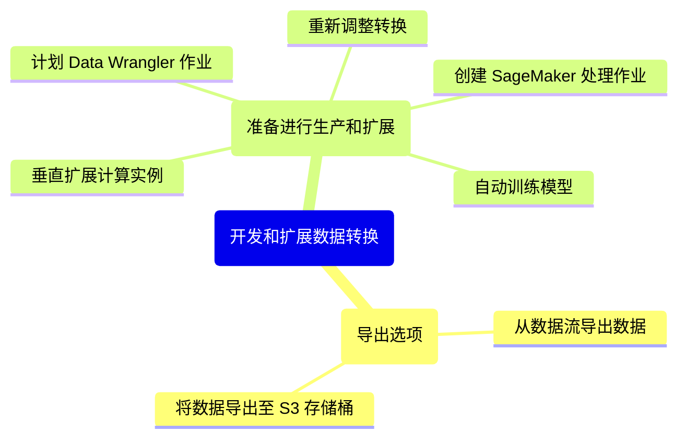

# 模块 2：探索性数据分析和数据准备

## 概览

学习目标：

* 解释如何使用 Amazon SageMaker Data Wrangler 将原始数据转换为训练数据集。
* 描述摄取和导入数据的方法。
* 描述如何生成数据见解并了解数据质量。
* 确定如何使用可视化工具查找潜在错误和极值。
* 解释如何在不编写代码的情况下转换和扩展数据准备工作流。

## SageMaker Data Wrangler

数据处理是一个专注于数据本身的迭代过程。它还要考虑训练模型的性能。因此，需要一个标准化平台，来为数据可视化、转换和模型验证提供用户友好的工具。Amazon SageMaker Data Wrangler 就是这样的平台。

SageMaker Data Wrangler 是一款专门构建的数据聚合和准备工具，可解决 ML 生命周期中的各种挑战。它通过一个单一可视化界面，简化了数据选择、清理、探索和可视化等数据准备和特征工程的过程。SageMaker Data Wrangler 包括 300 多种数据转换，您可以使用这些转换来转换数据。此外，您还可以使用 PySpark、SQL 和 Python 的 pandas 软件库编写自定义转换。

使用 SageMaker Data Wrangler，可将为 ML 收集和准备数据的时间从几周缩短到几分钟。您可以使用 SQL 从各种数据源导入数据。您可以使用数据质量和见解报告自动检查数据质量并查找异常情况，例如重复行和目标泄露。

### 运作方式

使用 SageMaker Data Wrangler 中的内置数据转换，您可以立即转换数据，而无需编写任何代码。在 SageMaker Data Wrangler 包含的 UI 中，您可以通过 SageMaker 数据处理作业将数据准备工作流扩展到整个数据集。您还可以使用 Amazon SageMaker Autopilot 训练、优化和部署模型，或部署用于推理的数据准备流。

1. **SageMaker Data Wrangler**：使用 SageMaker Data Wrangler 以可视化的方式更快地为 ML 聚合和准备数据。
2. **选择和查询**：从 Amazon 和非 Amazon 源（包括 Amazon Redshift、Amazon Athena 和 Snowflake）导入数据。
3. **可视化**：使用预配置的可视化模板以图形方式理解数据并检测异常值。
4. **清理和扩充**：清理和探索数据，使用内置数据转换执行特征工程，并且使用 Amazon SageMaker Clarify 检测统计偏差。
5. **了解**：使用样本数据集快速评估模型性能、测量准确性并诊断潜在问题。
6. **实施**：将数据准备工作流导出到笔记本或代码脚本以将工作流运用到生产环境中。
7. **集成数据准备工作流**：使用 Amazon SageMaker Pipelines 集成数据准备工作流。
8. **导出准备好的数据**：将数据导出到 Amazon SageMaker Feature Store 或 Amazon S3。

## 数据分析

### 数据摄取

借助 SageMaker Data Wrangler 数据选择工具，您可以访问和选择来自各种常用亚马逊云科技源和 40 多个第三方源的数据。

亚马逊云科技源的示例包括：

* Amazon S3
* Athena
* Amazon Redshift
* Amazon EMR

第三方源的示例包括：

* Snowflake
* Databricks
* Salesforce
* SAP
* Facebook Ads
* Google Analytics

#### 导入数据

SageMaker Data Wrangler 可帮助您导入和联接来自不同或相同数据源的多个数据集。它提供了一个数据流窗格，能够可视化多个数据转换流。这样，您便可以通过一个单一用户界面工作台聚合来自多个来源的数据集。您可以分析和转换多个数据流，而无需切换平台。

#### 自动化和部署 ML 准备工作流

利用 SageMaker Data Wrangler UI，您可以启动和扩展大型数据集，而无需编写 PySpark 代码、安装 Apache Spark 或启动集群。您可以启动或计划作业来快速处理您的数据或将其导出到 Amazon SageMaker Studio 笔记本。

SageMaker Data Wrangler 提供多种导出选项，包括 SageMaker Data Wrangler 作业、SageMaker Feature Store、SageMaker Autopilot 和 SageMaker Pipelines。这样，您就可以将数据准备流集成到 ML 工作流中。或者，您也可以将数据准备工作流部署到 SageMaker 托管终端节点。

### 数据见解和质量

SageMaker Data Wrangler 包括数据质量和见解报告，它可自动验证数据质量，例如缺失值、重复行和数据类型。它可帮助检测数据中的异常情况，例如异常值、类不平衡和数据泄露。有效验证数据质量后，您可以应用领域知识来处理数据集以进行 ML 模型训练。

1. **描述性统计数据**

    见解报告的第一部分提供有关数据集的描述性统计数据，其中包括一般信息，例如缺失值、无效值、特征类型、异常值计数等。它还可以包括指出数据可能存在的问题的高优先级警告。
2. **异常样本**

    SageMaker Data Wrangler 使用孤立森林算法检测异常样本。孤立森林按以下规则将异常分数与数据集的每个样本（行）相关联：

    * 低异常分数指示异常样本。
    * 高分数与非异常样本相关联。
    * 异常分数为负数的样本通常被认为是异常的。
    * 异常分数为正数的样本被认为是非异常的。

    样本异常可能是数据集中存在异常数据点所致。您可以通过从数据集中删除这些样本来减轻这些样本的影响。但是，建议您在检查异常样本时使用领域知识和业务逻辑。
3. **特征摘要**

    特征摘要主题提供有关数据集中各种特征的预测能力的信息。它按预测能力对特征进行排名，并将分数归一化到 [0,1] 范围内。注意以下规则：

    * 预测分数越高，表明列对于独自预测目标越有用。
    * 分数较低，表明列不能预测目标列。分数低通常表示相应特征是多余的。
    * 1 分意味着完美的预测能力，这通常表明发生了目标泄露。

    如果数据集包含在预测时不可用的列，通常会发生目标泄露。例如，它可能与目标列重复。这有助于识别过时的特征，您可以删除这些特征以降低数据集维数并提高模型准确性。
4. **分布图**

    见解报告提供对数据集的全局分析，而且还提供关注数据集中每个特征的局部分析。这包括特征的分布图以及对目标标签的相关效应。还包括相关特征的更详细的描述性统计数据。此外，您可以将该报告保存到本地驱动器，与感兴趣的人共享以便于开展协作。

### 数据可视化

SageMaker Data Wrangler 通过过一组强大稳健的内置可视化工具帮助您理解数据并识别潜在错误和极值。直方图、散点图、箱线图、折线图和条形图应有尽有，并且均已预定义，可应用于您的数据。

SageMaker Data Wrangler 还包括更高级的特定于 ML 的可视化工具（例如偏差报告、特征相关性、多重共线性、目标泄露和时间序列），以便获取对您的数据集更深入的见解。其中一些见解包括特征重要性、特征相关性和偏差。此外，还提供了一个自定义可视化工具，可以使用 Vega-Altair（Python 的统计可视化库）来绘图。

您可以通过在 SageMaker Data Wrangler 的 Analysis（分析）选项卡中选择相应的工具，来访问不同的分析和可视化工具。

* 分析【直方图】
* 分析【特征相关性】

## 快速模型

### 快速模型功能

SageMaker Data Wrangler 快速模型功能可提供对数据预期预测能力的估计。此功能还可根据 ML 问题给出模型指标分数。创建快速模型图表时，您需要选择要评估的数据集和要与特征重要性进行比较的目标标签。

### SageMaker Data Wrangler 的能力

SageMaker Data Wrangler 可帮助您为 ML 准备表格和图像数据。

1. **推断数据类型**：SageMaker Data Wrangler 可推断目标标签的数据类型和所选数据集中的每个特征。
2. **确定问题类型**：根据标签列中不同值的数量，SageMaker Data Wrangler 确定这是回归问题类型还是分类问题类型。它将分类阈值设置为 100。如果标签列中的不同值超过 100 个，则归类为回归问题；否则，归类为分类问题。
3. **预处理特征和标签数据**：算法要求将特征编码为向量类型，将标签编码为双精度类型。
4. **训练随机森林算法**：针对回归问题，使用 Spark RandomForestRegressor 来训练模型。针对分类问题，使用 RandomForestClassifier 来训练模型。
5. **评估随机森林模型**：SageMaker Data Wrangler 使用 F1 分数评估分类模型，使用均方误差 (MSE, mean squared error) 分数评估回归模型。
6. **计算特征重要性**：SageMaker Data Wrangler 使用基尼重要性方法计算每个特征的特征重要性。

> 不建议使用快速模型来微调数据预处理管道或优化特征选择。

## 转换数据

SageMaker Data Wrangler 提供了 300 多种基于 PySpark 的内置数据转换。这意味着您可以在不编写代码的情况下转换数据和扩展数据准备工作流。

内置转换覆盖常见使用案例，例如：

* 扁平化 JSON 文件
* 删除重复行
* 使用数据平衡技术，例如合成少数类过采样技术 (SMOTE, Synthetic Minority Oversampling Technique)
* 用平均值或中位数插补缺失数据
* 使用独热编码
* 使用特定于时间序列的转换器来加速为 ML 准备时间序列数据

### 添加转换

您可以使用 PySpark、SQL 和 pandas 编写自定义转换。SageMaker Data Wrangler 提供了一个庞大的代码片段库，帮助您更高效地编写自定义转换。

此外，还针对时间序列和个性化建议数据集提供了专门的内置转换。使用搜索栏可查找要在数据集上实施的转换类型。

您可以从 **Transform**（转换）选项卡将转换添加到数据流中的任何步骤。您可以按自己要使用的名称搜索转换，例如 drop。SageMaker Data Wrangler 会在结果中突出显示查询。

### 时间序列转换

SageMaker Data Wrangler 为时间序列分析提供了低代码解决方案，便于更快地准备和转换数据。它还可以帮助数据科学家按照预测模型的格式要求准备时间序列数据。时间序列转换能力包括描述性分析、解释性分析以及数据准备和特征工程。

1. [描述性分析](#描述性分析)
2. [解释分析](#解释分析)
3. [数据准备和特征工程](#数据准备和特征工程)

#### 描述性分析

通常，任何数据科学项目的第一步都是理解数据。如果针对时间序列数据进行绘图，可以获得其模式的简要概览。这些模式包括以下内容：

* 趋势
* 季节性
* 周期
* 随机变化

此概览可帮助您确定准确表示模式所需的正确预测方法。绘图还可以帮助识别异常值，从而防止不切实际和不准确的预测。SageMaker Data Wrangler 包含季节性趋势分解可视化工具，用于表示时间序列的组成部分。它还具有异常值检测可视化工具，用于识别异常值。

#### 解释分析

对于多元时间序列，能够对两个或多个时间序列之间的关系进行探索、识别和建模对于获得有意义的预测至关重要。SageMaker Data Wrangler 中的**分组**转换通过对指定单元的数据进行分组来创建多个时间序列。此外，在适用的情况下，您还可以使用时间序列转换来指定要作为分组依据的其他 ID 列，从而进行复杂的时间序列分析。

#### 数据准备和特征工程

时间序列数据很少是时间序列模型期望的格式。通常需要进行数据准备，以将原始数据转换为特定于时间序列的特征。您可能希望，在分析之前验证时间序列数据的间隔是否有规律或是等间隔。为此，您可以使用 SageMaker Data Wrangler 内置转换验证时间戳。对于预测使用案例，您还可以加入其他时间序列特征。

* **自相关**：用于检查两个样本在不同时间点的相似性。它对于识别重复的周期模式很有用。
* **滞后特征**：是基于过去可以影响未来信息这一假设，通过将变量移到之前的时间戳来创建的。这种特征对于通过观察变量之前的行为来了解其未来的行为很有用。
* **重采样**：通常，时间序列数据包含不同的时间步长，特别是在粒度较低的情况下。重采样通过按规则的时间步长进行数据采样，来帮助减少不规则的时间步长。这对于大多数时间序列算法都很有益。
* **滚动窗口**：通常假设模型参数相对于时间是不变的。滚动窗口技术有助于验证参数是否具备时不变性。

使用 SageMaker Data Wrangler，您可以创建特征（例如多个滞后期的滞后列），并按多个时间粒度对数据进行重采样。然后，您可以利用内置转换自动提取时间序列的统计属性，而无需编写代码。

## 开发和扩展数据转换

### 导出选项

SageMaker Data Wrangler 提供了在应用转换后从数据流导出数据的选项。

* **从数据流导出数据**

    可以将数据导出到以下目标，以用于训练模型或者做其他分析：

    * Amazon S3
    * SageMaker Pipelines
    * SageMaker 推理管道
    * Python 代码
    * SageMaker Feature Store
    * Amazon Personalize
* **将数据导出至 S3 存储桶**

    您可以将数据导出至 S3 存储桶中的某个位置。首先，您要创建一个目标节点，用以将您执行的一系列数据处理步骤输出到 Amazon S3。目标节点会告诉 SageMaker Data Wrangler 在您处理数据后将数据存储在哪里。创建目标节点后，您可以创建处理作业来输出数据。该处理作业是 SageMaker 处理作业。当您使用目标节点时，它会运行将已转换数据输出至 Amazon S3 所需的计算资源。

    注意以下事项：

    * 您可以使用目标节点导出您在 SageMaker Data Wrangler 流中进行的部分或全部转换。
    * 您可以在数据流中的不同点，使用多个目标节点来导出不同的转换或转换集。

### 准备进行生产和扩展

SageMaker Data Wrangler 提供了许多功能，可以帮助您准备数据流以用于生产环境。这些功能包括重新调整转换、计划 SageMaker Data Wrangler 作业、垂直扩展计算实例、创建 SageMaker 处理作业以及自动训练模型。

* **重新调整转换**

    您可以在数据集上重新调整转换，例如序号编码或独热编码。这些编码输出被称为训练参数。由于数据集会随着时间的推移而变化，可能需要对以前未见过的数据重新调整编码，以使转换流保持适用于数据。

    SageMaker Data Wrangler 提供了重新调整训练参数的功能。借助此功能，您可以选择使用之前的训练参数并根据需要进行重新调整。此功能在以下场景中很有用：

    * 有新数据添加到数据集中。
    * 对样本数据执行特征工程后，在完整数据集上进行训练。
* **计划 Data Wrangler 作业**

    您可以计划让 SageMaker Data Wrangler 作业在一周中的特定时间和日期运行，以处理新数据。计划还可以作为 cron 表达式输入，以实现额外的定制和灵活性。例如，您可以计划让某个作业一个在日历月的第一个星期三运行。

    您最多可以为一个 SageMaker Data Wrangler 处理作业附加两个计划。添加计划时，SageMaker Data Wrangler 会显示作业接下来的 5 次运行计划预览，以供进一步确认。
* **垂直扩展计算实例**

    在处理大型数据集时，您可以选择垂直扩展计算实例，以处理大型数据集的分析和转换。您可以使用 SageMaker Data Wrangler 会话 UI。此功能在以下场景中很有用：

    * 数据集的样本非常大。
    * 您决定将完整数据集（不进行采样）导入到 SageMaker Data Wrangler 中。
* **创建 SageMaker 处理作业**

    您创建了一个 SageMaker Data Wrangler 配方（转换流文件），其中包含在导入的数据集上实施的所有转换步骤。您还可以创建 SageMaker 处理作业，将数据转换扩展到与创建配方文件所使用的数据集具有相同架构的更大数据集。

    您可以从 SageMaker Data Wrangler UI 和 Jupyter notebook 创建 SageMaker 处理作业。您可以垂直和水平扩展计算实例，以使用 SageMaker Data Wrangler 流文件转换数据。
* **自动训练模型**

    您可以使用 SageMaker Autopilot 根据您在 SageMaker Data Wrangler 中转换的数据自动训练、优化和部署模型，而无需编写代码。SageMaker Autopilot 可以遍历多种算法，并使用最适合您的数据的算法。当您训练和优化模型时，SageMaker Data Wrangler 会将您的数据导出到 SageMaker Autopilot 可以访问的 Amazon S3 位置。

    但是，通过 SageMaker Data Wrangler 训练模型是可选的，因为并非所有数据预处理都旨在构建模型。然而，当您需要使用转换后的数据集训练模型时，此做法很有用。您可以使用 SageMaker Data Wrangler 和 SageMaker Autopilot 来训练模型。

## 知识考核

* 以下哪句话最能描述 Amazon SageMaker Data Wrangler？

    - [X] 它是一款专门构建的数据聚合和准备工具。
    - [ ] 它是一种交互式查询服务，使用标准 SQL 来分析 Amazon S3 中的数据。
    - [ ] 它是一个无服务器、键值 NoSQL 数据库。
    - [ ] 它是一种对象存储服务。
* Amazon SageMaker Data Wrangler 支持哪些数据源？（选择三项。）

    - [X] Amazon Athena
    - [ ] Amazon DynamoDB
    - [X] Amazon EMR
    - [X] Amazon S3
    - [ ] Amazon RDS
    - [ ] Amazon Aurora

## 总结

在本模块中，您了解了 SageMaker Data Wrangler 如何将为 ML 聚合和准备表格和图像数据所需的时间从几周缩短到几分钟。

您学习了以下要点：

* 借助 SageMaker Data Wrangler，您可以简化数据准备和特征工程的过程。您可以从一个单一可视化界面完成数据准备工作流的每个步骤（包括数据选择、清理、探索、可视化和大规模处理）。
* 您可以摄取和联接来自多个源的数据集。您无需编写任何代码即可可视化和转换数据集。
* 完成数据准备工作流后，您可以使用 SageMaker 数据处理作业将其扩展到完整数据集。
* 在 SageMaker Data Wrangler UI 中，您可以计划作业，以处理新数据集。您可以使用 SageMaker Autopilot 训练、优化和部署模型，以及部署用于推理的数据准备流。

在本课程系列的下一个模块中，您将学习 ML 模型构建和评估指标。

## 其他资源

* [SageMaker Data Wrangler](https://aws.amazon.com/sagemaker/data-wrangler/)
* [SageMaker Data Wrangler 开发人员指南](https://docs.aws.amazon.com/sagemaker/latest/dg/data-wrangler.html)
* [Amazon SageMaker Data Wrangler 博客](https://aws.amazon.com/blogs/machine-learning/category/artificial-intelligence/sagemaker/amazon-sagemaker-data-wrangler/)
* [亚马逊 re:Post](https://repost.aws/search/content?globalSearch=Data+Wrangler)