# 模块 2：探索性数据分析和数据准备

## 概览

学习目标：

* 解释如何使用 Amazon SageMaker Data Wrangler 将原始数据转换为训练数据集。
* 描述摄取和导入数据的方法。
* 描述如何生成数据见解并了解数据质量。
* 确定如何使用可视化工具查找潜在错误和极值。
* 解释如何在不编写代码的情况下转换和扩展数据准备工作流。

## SageMaker Data Wrangler

数据处理是一个专注于数据本身的迭代过程。它还要考虑训练模型的性能。因此，需要一个标准化平台，来为数据可视化、转换和模型验证提供用户友好的工具。Amazon SageMaker Data Wrangler 就是这样的平台。

SageMaker Data Wrangler 是一款专门构建的数据聚合和准备工具，可解决 ML 生命周期中的各种挑战。它通过一个单一可视化界面，简化了数据选择、清理、探索和可视化等数据准备和特征工程的过程。SageMaker Data Wrangler 包括 300 多种数据转换，您可以使用这些转换来转换数据。此外，您还可以使用 PySpark、SQL 和 Python 的 pandas 软件库编写自定义转换。

使用 SageMaker Data Wrangler，可将为 ML 收集和准备数据的时间从几周缩短到几分钟。您可以使用 SQL 从各种数据源导入数据。您可以使用数据质量和见解报告自动检查数据质量并查找异常情况，例如重复行和目标泄露。

### 运作方式

使用 SageMaker Data Wrangler 中的内置数据转换，您可以立即转换数据，而无需编写任何代码。在 SageMaker Data Wrangler 包含的 UI 中，您可以通过 SageMaker 数据处理作业将数据准备工作流扩展到整个数据集。您还可以使用 Amazon SageMaker Autopilot 训练、优化和部署模型，或部署用于推理的数据准备流。

1. **SageMaker Data Wrangler**：使用 SageMaker Data Wrangler 以可视化的方式更快地为 ML 聚合和准备数据。
2. **选择和查询**：从 Amazon 和非 Amazon 源（包括 Amazon Redshift、Amazon Athena 和 Snowflake）导入数据。
3. **可视化**：使用预配置的可视化模板以图形方式理解数据并检测异常值。
4. **清理和扩充**：清理和探索数据，使用内置数据转换执行特征工程，并且使用 Amazon SageMaker Clarify 检测统计偏差。
5. **了解**：使用样本数据集快速评估模型性能、测量准确性并诊断潜在问题。
6. **实施**：将数据准备工作流导出到笔记本或代码脚本以将工作流运用到生产环境中。
7. **集成数据准备工作流**：使用 Amazon SageMaker Pipelines 集成数据准备工作流。
8. **导出准备好的数据**：将数据导出到 Amazon SageMaker Feature Store 或 Amazon S3。

## 数据分析

### 数据摄取

借助 SageMaker Data Wrangler 数据选择工具，您可以访问和选择来自各种常用亚马逊云科技源和 40 多个第三方源的数据。

亚马逊云科技源的示例包括：

* Amazon S3
* Athena
* Amazon Redshift
* Amazon EMR

第三方源的示例包括：

* Snowflake
* Databricks
* Salesforce
* SAP
* Facebook Ads
* Google Analytics

#### 导入数据

SageMaker Data Wrangler 可帮助您导入和联接来自不同或相同数据源的多个数据集。它提供了一个数据流窗格，能够可视化多个数据转换流。这样，您便可以通过一个单一用户界面工作台聚合来自多个来源的数据集。您可以分析和转换多个数据流，而无需切换平台。

#### 自动化和部署 ML 准备工作流

利用 SageMaker Data Wrangler UI，您可以启动和扩展大型数据集，而无需编写 PySpark 代码、安装 Apache Spark 或启动集群。您可以启动或计划作业来快速处理您的数据或将其导出到 Amazon SageMaker Studio 笔记本。

SageMaker Data Wrangler 提供多种导出选项，包括 SageMaker Data Wrangler 作业、SageMaker Feature Store、SageMaker Autopilot 和 SageMaker Pipelines。这样，您就可以将数据准备流集成到 ML 工作流中。或者，您也可以将数据准备工作流部署到 SageMaker 托管终端节点。

### 数据见解和质量

SageMaker Data Wrangler 包括数据质量和见解报告，它可自动验证数据质量，例如缺失值、重复行和数据类型。它可帮助检测数据中的异常情况，例如异常值、类不平衡和数据泄露。有效验证数据质量后，您可以应用领域知识来处理数据集以进行 ML 模型训练。

1. **描述性统计数据**

    见解报告的第一部分提供有关数据集的描述性统计数据，其中包括一般信息，例如缺失值、无效值、特征类型、异常值计数等。它还可以包括指出数据可能存在的问题的高优先级警告。
2. **异常样本**

    SageMaker Data Wrangler 使用孤立森林算法检测异常样本。孤立森林按以下规则将异常分数与数据集的每个样本（行）相关联：

    * 低异常分数指示异常样本。
    * 高分数与非异常样本相关联。
    * 异常分数为负数的样本通常被认为是异常的。
    * 异常分数为正数的样本被认为是非异常的。

    样本异常可能是数据集中存在异常数据点所致。您可以通过从数据集中删除这些样本来减轻这些样本的影响。但是，建议您在检查异常样本时使用领域知识和业务逻辑。
3. **特征摘要**

    特征摘要主题提供有关数据集中各种特征的预测能力的信息。它按预测能力对特征进行排名，并将分数归一化到 [0,1] 范围内。注意以下规则：

    * 预测分数越高，表明列对于独自预测目标越有用。
    * 分数较低，表明列不能预测目标列。分数低通常表示相应特征是多余的。
    * 1 分意味着完美的预测能力，这通常表明发生了目标泄露。

    如果数据集包含在预测时不可用的列，通常会发生目标泄露。例如，它可能与目标列重复。这有助于识别过时的特征，您可以删除这些特征以降低数据集维数并提高模型准确性。
4. **分布图**

    见解报告提供对数据集的全局分析，而且还提供关注数据集中每个特征的局部分析。这包括特征的分布图以及对目标标签的相关效应。还包括相关特征的更详细的描述性统计数据。此外，您可以将该报告保存到本地驱动器，与感兴趣的人共享以便于开展协作。

### 数据可视化

SageMaker Data Wrangler 通过过一组强大稳健的内置可视化工具帮助您理解数据并识别潜在错误和极值。直方图、散点图、箱线图、折线图和条形图应有尽有，并且均已预定义，可应用于您的数据。

SageMaker Data Wrangler 还包括更高级的特定于 ML 的可视化工具（例如偏差报告、特征相关性、多重共线性、目标泄露和时间序列），以便获取对您的数据集更深入的见解。其中一些见解包括特征重要性、特征相关性和偏差。此外，还提供了一个自定义可视化工具，可以使用 Vega-Altair（Python 的统计可视化库）来绘图。

您可以通过在 SageMaker Data Wrangler 的 Analysis（分析）选项卡中选择相应的工具，来访问不同的分析和可视化工具。

* 分析【直方图】
* 分析【特征相关性】

```mermaid
mindmap
((数据分析))
    (数据摄取)
        [亚马逊云科技的服务]
            Amazon S3
            Athena
            Amazon Redshift
            Amazon EMR
        [第三方服务]
            Snowflake
            Databricks
            Salesforce
            SAP
            Facebook Ads
            Google Analytics
    (数据见解和质量)
        描述性统计数据
        异常样本
        特征摘要
        分布图
    (数据可视化)
        直方图
        特征相关性
```

