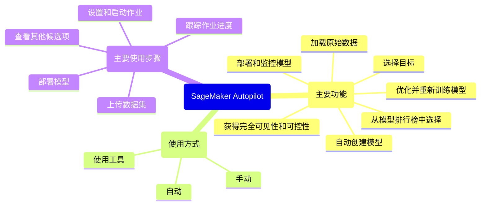
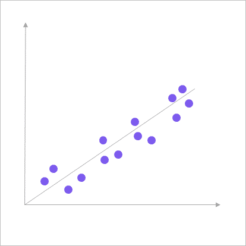
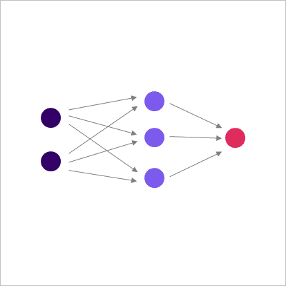
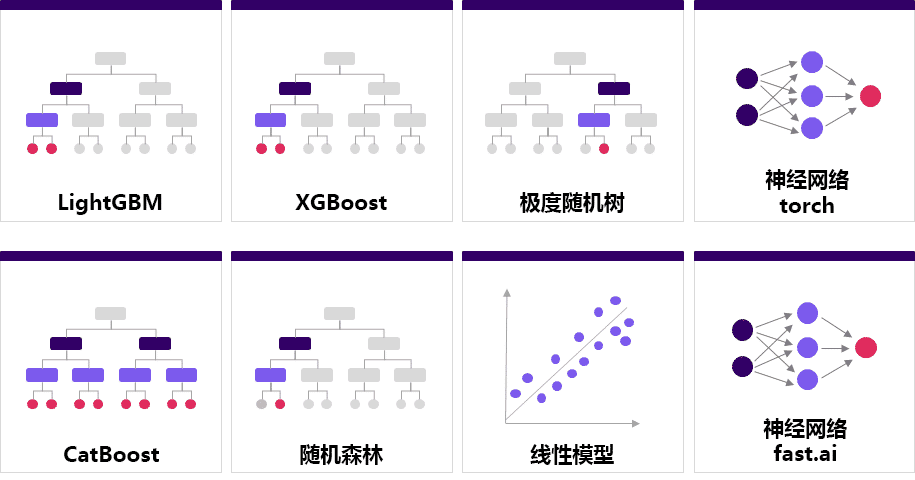
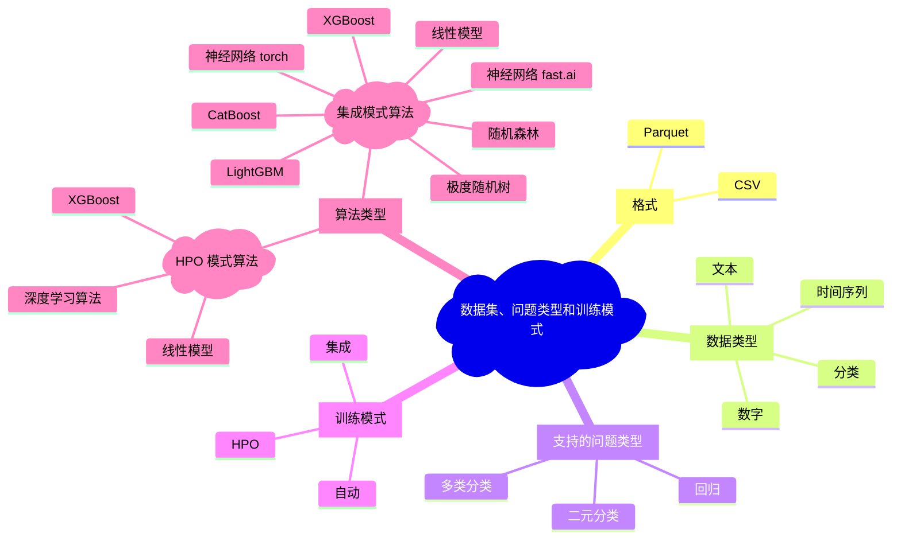

# 模块 3：深入讨论 Amazon SageMaker Autopilot

## 概览

学习目标：

* 描述 Amazon SageMaker Autopilot 的功能。
* 使用 SageMaker Autopilot 启动作业、跟踪其进度以及部署模型。
* 描述支持的数据格式和类型、问题类型、训练模式和算法。
* 解释 SageMaker Autopilot 如何通过 k 折分割执行交叉验证。
* 描述性能报告中可用的模型质量指标。
* 描述 SageMaker Autopilot 如何解决模型可解释性问题。
* 部署具有实时或批量预测的模型。

## SageMaker Autopilot 简介

Amazon SageMaker Autopilot 消除了构建机器学习 (ML, machine learning) 模型过程中的手动工作。您提供表格数据集并选择要预测的目标列，SageMaker Autopilot 便会自动探索不同的解决方案，以找到最佳模型。

* 它自动执行 ML 过程中的关键任务，包括探索数据和选择适用于您的问题类型的算法。
* 它还自动执行准备数据这一任务，以促进模型训练和优化。
* 然后，您可以直接高效地将模型部署到生产环境中，也可以对推荐的解决方案进行迭代，从而进一步提高模型质量。

### SageMaker Data Wrangler 和 SageMaker Autopilot 比选

* 重要区别：
    * 使用 SageMaker Data Wrangler，您可以完全控制特征工程和预处理技术。
    * 而使用 SageMaker Autopilot，整个过程是完全自动化的。
* 使用 SageMaker Data Wrangler 时，您能够在过程中运用您的领域专业知识，这通常是构建优质模型时最重要的要素。一种常见的做法是，在 SageMaker Data Wrangler 中设计特征。然后，您可以使用 SageMaker Autopilot 以底层训练算法所需的方式预处理数据。

### SageMaker Autopilot 的功能

1. **加载原始数据**：从 Amazon Simple Storage Service (Amazon S3) 加载表格数据来训练模型。
2. **选择目标**：选择要预测的目标列。
3. **自动创建模型**：选择正确的算法，系统将自动为正确的模型进行训练和优化。
4. **获得完全可见性和可控性**：获得模型笔记本的完全可见性。
5. **从模型排行榜中选择**：从排序推荐列表中选择最适合您需求的模型。
6. **部署和监控模型**：直接高效地将模型部署到生产环境。
7. **优化并重新训练模型**：对推荐的解决方案进行迭代，从而进一步提高模型质量。

您可以采用以下方式来使用 SageMaker Autopilot：

* **自动**：探索数据，选择适用于问题类型相关的算法，并准备数据以促进模型训练和优化。
* **手动**：在人工引导下使用 Amazon SageMaker Studio。
* **使用工具**：使用 Amazon SDK。

### 使用 SageMaker Autopilot 的主要步骤

1. **上传数据集**

    在对数据集运行 SageMaker Autopilot 之前，需要先检查数据集以确保其没有明显错误。SageMaker Autopilot 过程可能需要很长时间，因此最好在启动作业之前检查数据集。对于笔记本实例内存无法容纳的较大数据集，请使用大数据分析工具（例如 Apache Spark）离线检查数据集。

    > SageMaker Autopilot 能够处理最高达 5 GB 的数据集。它会为您预处理数据。您不需要执行传统的数据预处理技术，例如处理缺失值、将分类特征转换为数字特征、扩展数据，以及处理更复杂的数据类型。此外，也没有必要将数据集拆分为训练集和验证集。但是，您可能需要拆分出一个测试集。
2. **设置和启动作业**

    在将数据集上传到 Amazon S3 之后，您可以调用 SageMaker Autopilot 来查找用于基于数据集训练模型的最佳 ML 管道。为此，您需要创建一个试验来启动 SageMaker Autopilot 作业。您可以使用 SageMaker Studio UI 来帮助填充输入、输出、目标和参数。在该 UI 中，您还可以运行和评估试验或使用 SageMaker API 参考。

    在 SageMaker Autopilot 试验中调用作业所需的输入如下：

    * 输入数据集和所有输出构件的 Amazon S3 位置。
    * 要预测的数据集的目标列名称。
    * 训练方法和算法如下：选择集成或超参数优化 (HPO, hyperparameter optimization)。如果您不确定选择哪一个，SageMaker Autopilot 将根据目标列的统计数据推断问题类型。您还可以转到高级设置并选择 ML 问题类型，例如二元分类、回归或多类分类。
    * 部署设置如下：自动机器学习 (AutoML, Automatic machine learning) 会创建一个终端节点，用于部署您的最佳模型并在该终端节点上运行推理。您还可以从一组可用的候选试用模型中进行选择并手动部署。
3. **跟踪作业进度**

    SageMaker Autopilot 作业包含以下主要步骤：

    1. **数据分析**：对数据集进行分析，然后 SageMaker Autopilot 生成应使用数据集进行试验的 ML 管道的列表。数据集还拆分为训练集和验证集。
    2. **特征工程**：SageMaker Autopilot 在数据集的各个特征级别和聚合级别执行特征转换。
    3. **模型优化**：选择性能最佳的管道以及训练算法的最优超参数，这是管道的最后阶段。
4. **部署模型**

    您可以手动部署模型以使用最佳候选项执行批量推理。您也可以使用 SageMaker Autopilot 自动部署模型。

    批量推理，也称为离线推理，使用一批观察值生成模型预测。您在创建试验时选择此选项。

    SageMaker AutoML 在单独的容器中管理数据预处理、模型推理和后处理。为了将这些过程联系在一起，SageMaker Autopilot 使用推理管道机制从候选项创建 SageMaker 模型。
5. **查看其他候选项**

    您可以查看 SageMaker Autopilot 探索的所有候选项，并按它们的最终性能指标对进行排序。

    SageMaker Autopilot 生成两种类型的笔记本：**数据探索**和**候选生成**。它们的定义如下：

    * **数据探索笔记本**：数据探索笔记本提供数据集和分析结果的摘要，例如重复行、列之间的相关性、缺失值和基数。
    * **候选生成笔记本**：最佳模型候选生成笔记本包含数据预处理 (DPP, data preprocessing) 模块。它还包括作为数据探索和搜索超参数范围的结果生成的算法组合。候选生成笔记本还包含有关如何运行和部署优化作业的说明，因此您可以自定义笔记本，然后运行作业，而不是自动执行任务。

## 数据集、问题类型和训练模式

SageMaker Autopilot 为您提供了在 SageMaker Studio 中或使用 AutoML API 指定问题类型的选项，例如二元分类或回归。SageMaker Autopilot 还可以根据您提供的数据为您检测问题类型。SageMaker Autopilot 支持表格数据，其中每列包含一个具有特定数据类型的特征，每行包含一个观察值。

### 支持的格式和数据类型

#### 格式

SageMaker Autopilot 支持格式为 CSV 或 Parquet 文件的表格数据：

* **CSV** 是一种基于行的文件格式，以人类可读的纯文本形式存储数据。这是数据交换常用的文件格式，因为它受到广泛的应用程序的支持。
* **Parquet** 是一种基于列的文件格式，与基于行的文件格式相比，数据的存储和处理效率更高。对于大数据问题，这种格式是更好的选择。

#### 数据类型

对于使用逗号分隔数字字符串的列，**数字**、**分类**、**文本**和**时间序列**是可接受的数据类型。

#### 支持的问题类型

SageMaker Autopilot 支持三种问题类型。还有一个自动选择功能，它可以根据您提供的数据从三种问题类型中选择适当的算法。

* **回归**

    回归基于与因目标变量相关的一个或多个其他变量或属性，来估计该因目标变量的值。
* **二元分类**

    二元分类是一种有监督学习，它根据个体的属性将个体分配到两个预定义且互斥的类中的一个类。它之所以是有监督学习，是因为模型使用示例进行了训练，其中属性由正确标注的对象提供。
* **多类分类**

    多类分类是一种有监督学习，它根据个体的属性将个体分配到多个类中的一个类。它之所以是有监督学习，是因为模型使用示例进行了训练，其中属性由正确标注的对象提供。这方面的一个例子是预测与文本文档最相关的主题。

### 训练模式

SageMaker Autopilot 可以运行两种训练模式：超参数优化 (HPO, hyperparameter optimization) 和集成。第三种模式“自动”是一个决策点，用于决定是调用 HPO 还是集成。

1. **[HPO](#hpo)**：SageMaker Autopilot 通过优化超参数并使用数据集运行训练作业，来找到模型的最佳版本。
2. **[集成](#集成)**：SageMaker Autopilot 使用 AutoML 算法来训练多层堆栈集成模型，以直接根据您的数据预测回归和分类数据集。
3. **[自动](#自动)**：SageMaker Autopilot 可以根据您的数据集大小自动决定训练方法。

集成模式和 HPO 模式执行类似的步骤：数据预处理、特征工程、模型优化和评估。然而，它们采用了两种截然不同的技术或管道。

> 如果 SageMaker Autopilot 无法读取您的数据集大小，则默认为 HPO 模式。

#### HPO

对于 HPO 模式，SageMaker Autopilot 在使用数据集运行训练作业时，使用贝叶斯优化或多保真度优化来优化超参数，以此找到模型的最佳版本。HPO 模式会选择最适合您的数据集的算法。它还会选择最佳的超参数范围来优化模型。它通过运行多达 100 次试验（默认）来找到所选范围内的最佳超参数设置，从而实现上述目的。如果您的数据集大小小于 100 MB，则 SageMaker Autopilot 会使用贝叶斯优化。如果您的数据集大于 100 MB，则 SageMaker Autopilot 会选择使用多保真度优化。

在多保真度优化中，不断从训练容器中发出指标。就所选目标指标而言表现不佳的试验会提前停止。表现良好的试验会被分配更多资源。

#### 集成

对于集成模式，SageMaker Autopilot 使用 AutoGluon 库来训练多个基础模型。为了找到适合您的数据集的最佳组合，集成模式会使用不同的模型和元参数设置运行 10 次试验。然后，SageMaker Autopilot 使用堆叠集成方法组合模型，以创建最佳预测模型。

#### 自动

最后，在自动模式中，SageMaker Autopilot 会根据您的数据集大小自动选择 HPO 模式或集成模式。如果您的数据集大于 100 MB，则 SageMaker Autopilot 会选择 HPO 模式。否则，它会选择集成模式。在以下情况下，SageMaker Autopilot 可能无法读取您的数据集的大小：

* 如果您为 AutoML 作业启用 Virtual Private Cloud (VPC) 模式，但包含您的数据集的 S3 存储桶仅允许从 VPC 访问
* 如果您的数据集的输入 [S3DataType](https://docs.aws.amazon.com/sagemaker/latest/APIReference/API_AutoMLS3DataSource.html#sagemaker-Type-AutoMLS3DataSource-S3DataType) 是清单文件
* 如果输入 [S3Uri](https://docs.aws.amazon.com/sagemaker/latest/APIReference/API_AutoMLS3DataSource.html#sagemaker-Type-AutoMLS3DataSource-S3Uri) 包含超过 1,000 个项目

### 算法类型

根据所选的训练模式，SageMaker Autopilot 依赖于两组不同的算法：HPO 模式算法和集成模式算法。

#### HPO 模式算法

在 HPO 模式中，SageMaker Autopilot 选择以下训练算法之一：线性模型、XGBoost 和深度学习算法。

| 线性模型 | XGBoost | 深度学习算法 |
|---|---|---|
|  |  |  |

* **线性模型**是一种有监督学习算法，可以解决分类问题或回归问题。
* **XGBoost** 是一种有监督学习算法，它尝试准确地预测目标变量。它将一组不太复杂、较弱模型的估计集成在一起。
* 深度学习算法是一种**多层感知机 (MLP, multilayer perceptron)** 和前向人工神经网络。该算法可以处理不可线性分离的数据。

SageMaker 包含所有这些算法，因此您也可以独立于 SageMaker Autopilot 使用它们。它们可以扩展，因此 SageMaker Autopilot 中的 HPO 模式可以处理大型数据集。集成模式可以处理的数据集不能超过 100 MB。

#### 集成模式算法

SageMaker Autopilot 支持以下类型的 ML 算法：

* **LightGBM**

    LightGBM 是一种经优化的框架，它使用基于树的算法和梯度提升。该算法使用在广度而不是深度上生长的树，并且针对速度进行了高度优化。
* **XGBoost**

    XGBoost 是一种使用基于树的算法和梯度提升的框架，其中的树在深度而不是广度上生长。
* **极度随机树**

    极度随机树是一种基于树的算法，它在整个数据集上使用多个决策树。树在每一层随机分叉。对每棵树的决策进行平均，以防止过拟合并改进预测。与随机森林算法相比，极度随机树算法的随机性更大。
* **神经网络 torch**

    神经网络 torch 是一种使用 Pytorch 实施的神经网络模型。
* **CatBoost**

    CatBoost 是一种使用基于树的算法和梯度提升的框架。它针对处理分类变量进行了优化。
* **随机森林**

    随机森林是一种基于树的算法，它对具有替换的随机数据子样本使用多个决策树。这些树在每一层被分成最优节点。对每棵树的决策进行平均，以防止过拟合并改进预测。
* **线性模型**

    线性模型是一种使用线性方程来模拟观测数据中两个变量之间的关系的框架。
* **神经网络 fast.ai**

    神经网络 fast.ai 是一种使用 fast.ai 实施的神经网络模型。

